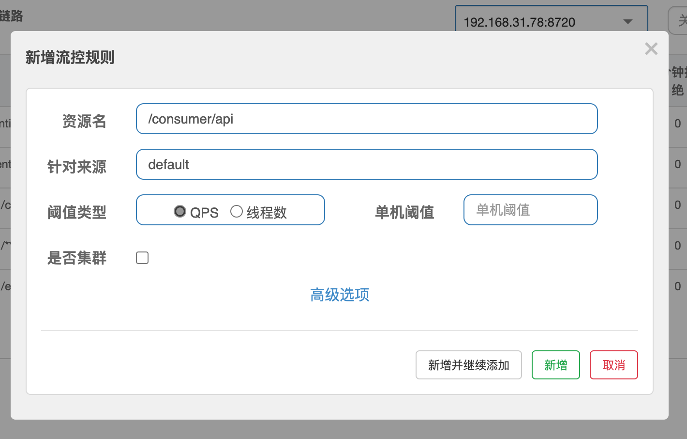
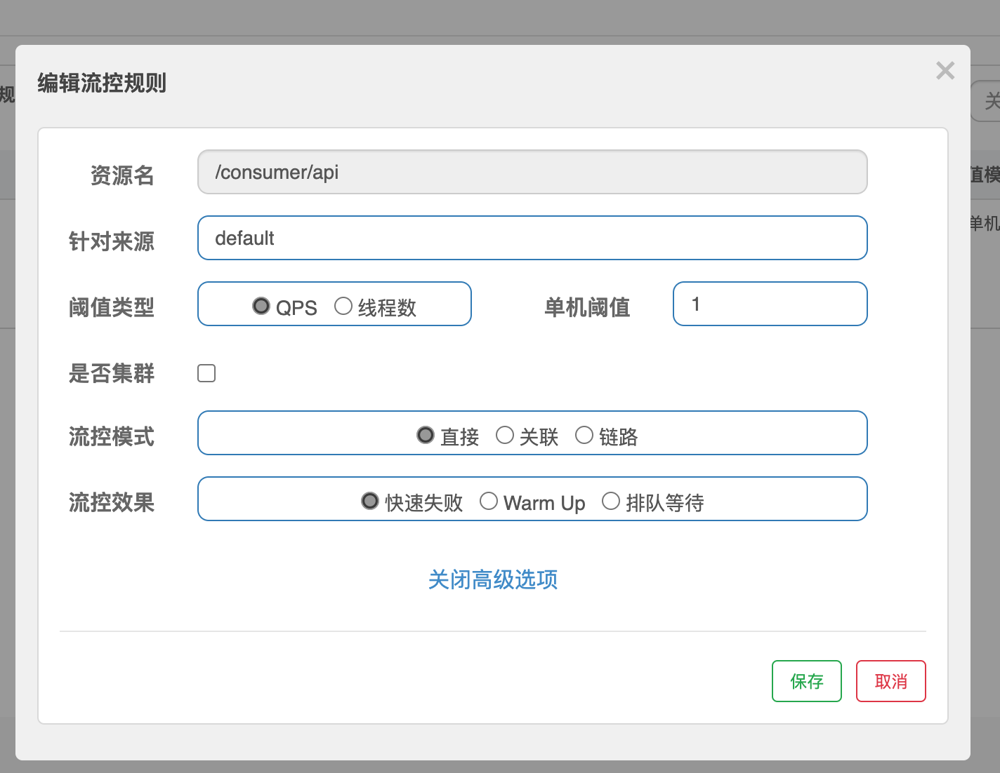
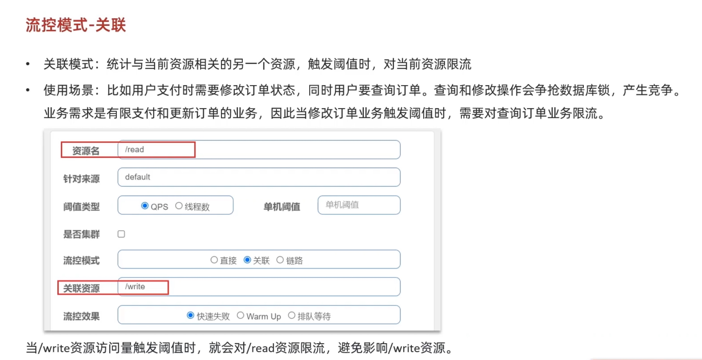
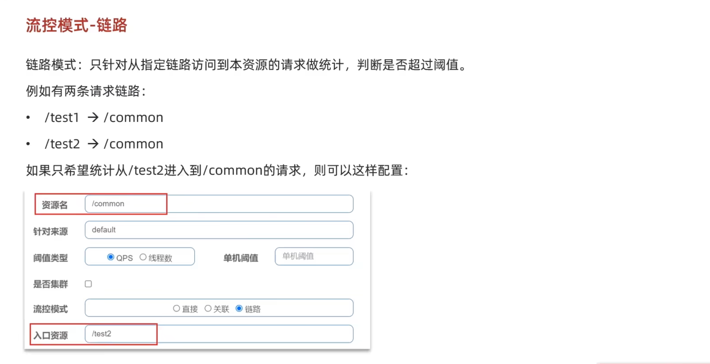
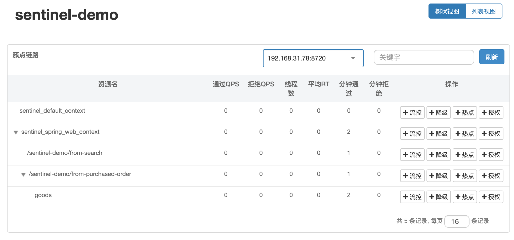
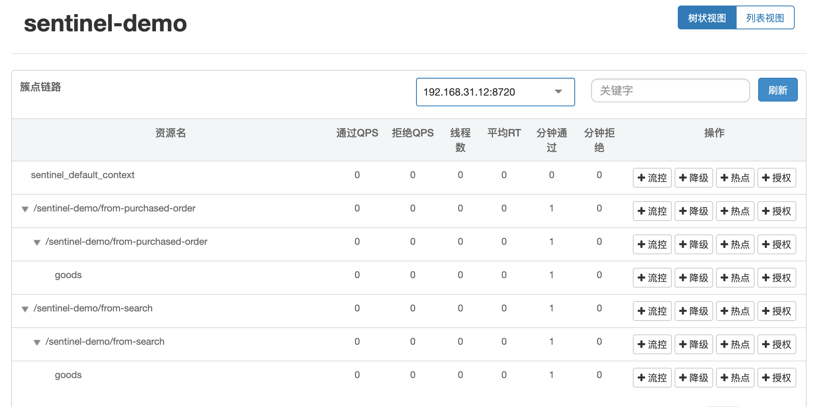
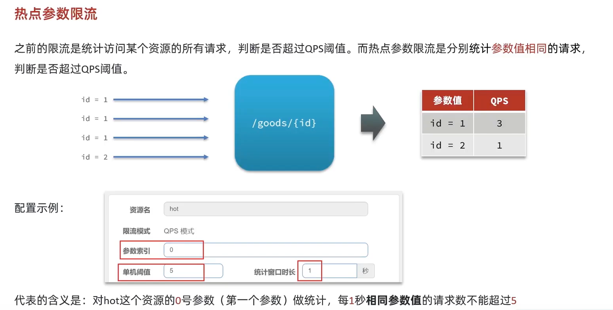
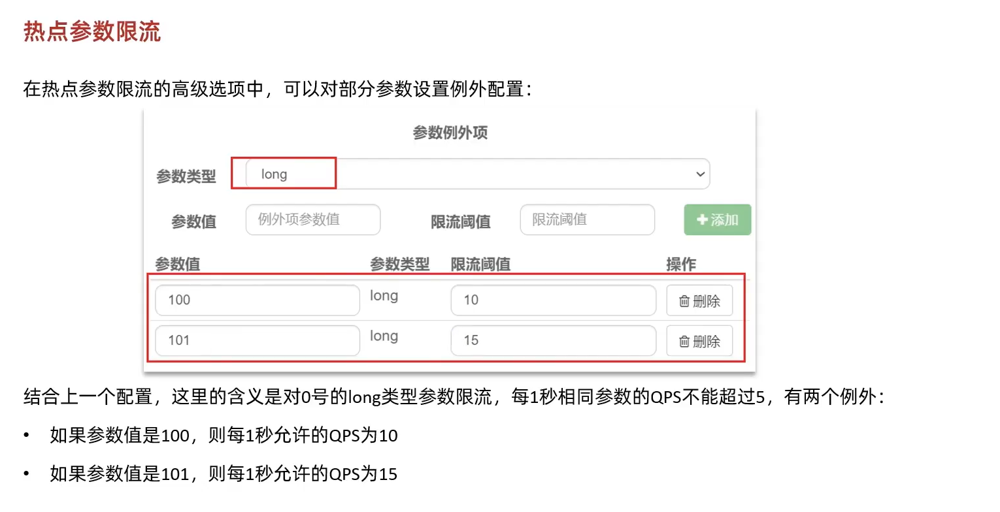

# 微服务与微服务架构

## 微服务与分布式入门

**微服务入门**

在微服务框架下，一个业务可能要由多个微服务来完成。当业务越来越多，越来越复杂的时候，就需要依靠 **注册中心** 来记录每个服务的 IP、端口及能完成的功能。

当其中一个服务需要调用另外一个服务时，只需要找注册中心拉取对应服务的信息即可。当然，前提是该服务有在注册中心注册过。

每个服务的配置也是同理，微服务中需要 **配置中心** 去热更新即可。每个服务都去配置中心拉取自己服务的配置信息，这样我们只需要去配置中心修改服务的配置，该服务就会自动完成热更新。

**服务网关** 可以校验用户是否有权限访问微服务，并将请求路由到对应的服务，以及实现负载均衡。

除了这几个基本的组件和数据库外，还可能需要分布式缓存、消息队列、分布式搜索、分布式日志服务等内容。

---

**分布式入门，及其与微服务的关系**

**分布式架构** ：根据业务功能模块对系统进行拆分，每个业务模块作为独立项目单独开发，该独立项目就被称为服务

分布式架构的优点：

- 降低服务的耦合
- 便于后续服务的升级和业务拓展后的开发

分布式架构需要考虑的问题：

- 服务拆分颗粒度
- 服务集群地址的维护
- 服务间的远程调用
- 服务健康状况的感知

分布式架构与微服务的关系：

- 微服务是一种经过良好架构设计的分布式架构方案

微服务架构的特征：

- 单一职责：颗粒度极小，每个服务对应唯一业务能力，避免业务重复开发
- 面向服务：微服务必须对外暴露业务接口，否则其他服务无法获取相应的业务能力
- 自治：团队独立、技术独立、数据独立、部署独立
- 隔离性强：服务调用需要做好隔离、容错、降级，避免出现级联问题

> 级联问题 / Cascading Failure（下文来自 AI）：
> 
> 在微服务架构或分布式系统中，服务之间的调用和依赖关系往往非常复杂。服务调用需要做好隔离、容错、降级处理，主要是为了保证系统的稳定性和可用性。
> 
> 在这个背景下，"级联问题"（也称为"级联故障"或"级联失败"）指的是当一个服务发生故障或者性能下降时，这个问题会像多米诺骨牌一样，逐级扩散到依赖它的其他服务，进而可能导致整个系统或多个服务的故障或性能下降。

>级联问题通常发生在服务间的调用链路较长的情况下，原因包括但不限于：
>
> **资源耗尽**：当一个服务因为故障或过载而响应变慢或停止响应时，依赖它的上游服务可能会积累大量等待响应的请求，这可能会导致线程池、连接池等资源耗尽，进而影响这些服务的正常功能。
> **雪崩效应**：在微服务架构中，如果一个底层服务出现问题，依赖于该服务的所有上游服务都可能受到影响，导致错误或延迟的放大，形成雪崩效应。

> 为了避免级联问题，通常需要采用一系列的策略：
> 
> **服务隔离**：通过限流、熔断、线程池隔离等技术手段，确保一个服务的问题不会影响到其他服务。例如，熔断器可以在检测到下游服务延迟过高时快速失败，避免请求堆积。
> **超时控制**：为服务调用设置合理的超时时间，避免因为等待一个服务响应而阻塞调用线程过长时间。
> **降级处理**：当下游服务不可用或响应时间过长时，可以通过降级策略提供一个预设的默认响应，保证用户体验和系统的基本运行。
> **容错处理**：通过重试机制、备份请求等方式提高系统的容错能力，但需要合理设计，避免过度重试导致的反作用。
>
> 通过这些策略的合理运用，可以在一定程度上防止或缓解级联问题，提高系统的整体稳定性和可用性。


> 参考资料：[黑马程序员 - SpringCloud+RabbitMQ+Docker+Redis+搜索+分布式](https://www.bilibili.com/video/BV1LQ4y127n4)

## 微服务基础

微服务：

* 强调的是服务的大小，关注的是某个点，是具体解决某一问题，提供对应服务的一个服务应用
* 强调的是一个个的个体，每一个个体完成一个具体的任务或功能

微服务架构：

- 一种架构形模式，包含了多个微服务
- 根据业务拆分服务，彻底解耦，每个微服务提供单个业务功能的服务，一个服务做一件事情

分布式架构（分散コンピューティング）会遇到的四个核心问题及解决方案：

1. 这么多服务，客户端该如何去访问？
   - API 网关，服务路由
2. 这么多服务，服务之间如何进行通信
   - HTTP，RPC 框架，异步调用
3. 这么多服务，如何治理？
   - 服务注册与发现，高可用
4. 服务挂了，怎么办？
   - 熔断机制，服务降级 

微服务怎么拆分？（拆分的边界？）

- 功能维度
- 业务维度
- 康威定律（考虑团队结构）
- 拆分粒度

# Spring Cloud 基础概念

> 相关资料：[冒着挂科的风险也要给你们看的 Spring Cloud 入门总结](https://juejin.cn/post/6844904007975043079)或者[Spring Cloud 入门总结](https://zhuanlan.zhihu.com/p/95696180)（两个链接都是同一篇，下文会大量引用）

## Spring Cloud 简介


> 图：Spring Cloud 总体框架

Spring Cloud 简介：

* 微服务系统架构的一站式解决方案
* 构建微服务的过程中需要做如 服务发现注册 、配置中心 、消息总线 、负载均衡 、断路器 、数据监控 等操作
* Spring Cloud 提供了一套简易的编程模型，使我们能在 Spring Boot 的基础上轻松地实现微服务项目的构建

Spring Cloud 和 Spring Boot 的关系：

* Cloud 协调微服务，boot 用于快速开发微服务（jar 包）。Cloud 离不开 boot，而 boot 可以单独运行
* 也就是说，Spring Boot 专注于快速开发单个个体微服务，Spring Cloud 关注全局的微服务治理框架。

Spring Cloud 和 Dubbo 的区别：

- Spring Cloud 是微服务架构的一站式解决方案
- Dubbo 的定位是一款 RPC 框架
- Spring Cloud 抛弃了 Dubbo 的 RPC 通信，采用的是基于 HTTP 的 REST 方式
- REST 没有 RPC 通信那样好的服务调用的性能，但是更加灵活
  - 服务提供方和调用方的依赖只靠 HTTP 来连接，不存在代码级别的强依赖
  - 所以在强调快速演化的微服务环境下，REST 更为适合。

## RESTful HTTP 通信

RESTful HTTP 协议通信：

- 作用：规范了 HTTP 通信协议的标准
- HTTP Method 约束资源操作类型：GET、POST、PUT、DELETE
- REST 是面向资源的，所以 Method 规范操作类型，而路径一般使用名词
  - 比如：GET `/order/${id}` 就表示查询该 id 的 order
- 通过 HTTP 返回码来表达返回的信息，比如 200 表示成功，400 表示找不到请求路径等

---

**多个服务间通信** ，其实可以转换为 **如何调用第三方的 HTTP 服务** 。

> 调用第三方 HTTP 服务可以使用 RestTemplate、HttpClient、OkHttp 和 JDK 的 HttpUrlConnection 等。

假设现在一个 user 服务想通过 `RestTemplate` 调用 order 服务，但是 order 服务是个集群，也就是有多个 order 服务，调用哪个都可以。

也就是说，**一旦涉及到业务拆分，使用了微服务架构，就必然涉及到远程通信。而在微服务中，经常会出现服务的集群。此时集群中的服务地址就必然要维护到客户端（消费端）**。

怎么请求资源，就涉及到了 **负载均衡**。此时需要：

1. 在 user 端配置目标服务的地址列表
2. 根据地址列表，做一个负载均衡的计算，决定请求哪个服务

> 负载均衡使用 Ribbon 组件。
> 
> Ribbon 的作用（[下文中还会提到一次](#what-ribbon-does)）：
> 
> 1. 解析配置中的服务器列表
> 
> 2. 基于负载均衡的算法实现请求的分发

使用 Ribbon 可以直接利用 `@LoadBalanced` 注解。

比如在配置 `RestTemplate` 的 Bean 的时候加上 `@LoadBalanced` 注解，然后就会发送请求之前，拦截请求，并根据 `IRule` Bean 的配置来设置怎么发送请求。可以参考[下文](#use-ribbon)。

---

现在 Spring Cloud 通信一般使用的是 Open Feign。它是一个声明式的伪 RPC 客户端，可以实现面向接口编程。使用方法可以参考[下文](#open-feign)。

## CAP 定理

> 下文来自 ChatGPT，有轻微错误，仅供参考

CAP（Consistency, Availability, and Partition tolerance）用于描述分布式系统中的三个基本性能特征：一致性、可用性和分区容错性：

- 一致性（Consistency）指的是所有节点在同一时间具有相同的数据

- 可用性（Availability）指的是系统中的所有请求都可以得到响应，即使某个节点发生故障

- 分区容错性（Partition tolerance）~~指的是系统在网络分区的情况下仍然可以继续~~ （注：有问题，看下面）
  
  - 网络分区：当网络中的一部分节点无法与另一部分节点进行通信时，网络被分割成不同的部分

CAP 定理指出，<u>在分布式系统中，只能同时保证两个，而不能三个同时保证</u>。

> 例如，一个典型的分布式系统可能会使用一致性和可用性的组合，以确保所有的节点在同一时间具有相同的数据，并且在任何情况下都可以提供响应。但是，这种组合不能保证系统在网络分区的情况下仍然可以继续工作。

---

最终一致性：

- 系统中所有节点最终都会保持相同的状态，即使在网络分区的情况下也是如此

- 优点：可以在网络分区的情况下继续工作

- 缺点：可能需要更长的时间来达到一致性

强一致性：

- 所有节点在同一时间具有相同的数据

- 优点：可以在更短的时间内达到一致性

- 缺点：不能在网络分区的情况下继续工作

> 例如，在银行的账户系统中，最终一性可能会导致客户在某个时间点看到不同的余额，但是最终会达到一致，而强一致性可以确保客户在任何时间点都看到相同的余额。

如果你需要在网络分区的情况下继续工作，那么最终一致性可能是最好的选择。

如果你需要在更短的时间内达到一致性，那么强一致性可能是最好的选择。

---

> 以下是之前整理的笔记

CAP 原则又称 CAP 定理，指的是在一个分布式系统中，**一致性（Consistency）**、**可用性（Availability）**、**分区容错性（Partition tolerance）**，这三个要素<u>最多只能同时实现两点</u>，不可能三者兼顾。

一致性（Consistency）：这里指的是强一致性

可用性（Availability）：请求会得到响应，而不是持续的等待

Partition tolerance（分区容错性）：

- 网络分区（脑裂）：当网络发生异常，导致分布式系统中部分节点之间的网络延时不断增加，导致组成分布式系统的所有节点，只有部分节点之间能够进行正常通信，而另一些节点则不能
- 分区容错性约束了一个分布式系统需要具有的如下特性：分布式系统在遇到任何网络分区故障的时候，仍然需要能够保证对外提供满足一致性和可用性的服务，除非是整个网络环境都发生了故障

简单来说，就是 **Partition tolerance（分区容错性）就是保证服务因为网络而故障的时候，业务端还能正常运行** 。实现起来，就是 **集群节点** 和 **跨区域的高可用** 。

在分布式系统中，Partition tolerance 必须得到满足，所以只能在 Consistency 和 Availability 之间权衡。

> 延伸阅读：[分布式的特性、面临的问题、中心化 & 去中心化、CAP理论、BASE理论](https://blog.csdn.net/qwesxd/article/details/108589781)

例如：

- Eureka 保证 AP：
  - <u>Eureka 各个节点是相等的</u>，如果发现节点连接失败，就自动转换到其他节点，也就是说，只要还有一台 Eureka，就能确保服务的可用性（保证 Availability）
  - 只不过，无法保证 Eureka 返回的信息是最新的（牺牲了 Consistency）
- Zookeeper 保证 CP：
  - 如果主要的 Server（Master）出现问题，就要重新选举，选举可能会耗费时间，导致服务暂时不可用（牺牲 Availability）
  - 但是这样可以保证所有数据备份，在同一时刻的值是相等的（要不无法读取，要不就读取最新的，保证 Consistency）

可以参考 [下文的 Eureka 部分](#eureka-ap)。

---

> 下文节选自：[最终一致性的实现方案 - Vincent-yuan](https://www.cnblogs.com/Vincent-yuan/p/16074577.html) （这篇文章推荐阅读）

数据一致性的基础理论：

强一致：

- 含义：当更新操作完成之后，任何多个后续进程或者线程的访问都会返回最新的更新过的值。

- 这种是对用户最友好的，就是用户上一次写什么，下一次就保证能读到什么。

- 根据 CAP 理论，这种实现需要牺牲可用性。

弱一致性：

- 含义：系统并不保证续进程或者线程的访问都会返回最新的更新过的值。

- 系统在数据写入成功之后，不承诺立即可以读到最新写入的值，也不会具体的承诺多久之后可以读到。

最终一致性：

- 含义：弱一致性的特定形式。系统保证在没有后续更新的前提下，系统最终返回上一次更新操作的值。

- 在没有故障发生的前提下，不一致窗口的时间主要受通信延迟，系统负载和复制副本的个数影响。DNS 是一个典型的最终一致性系统。

---

CAP定理（ていり）：

- ノード間のデータ複製において、同時に次の3つの保証を提供することはできない
- 一貫性 (Consistency)
  - すべてのデータ読み込みにおいて、最新の書き込みデータもしくはエラーのどちらかを受け取る
  - Every read receives the most recent write or an error
- 可用性 (Availability)
  - ノード障害により生存ノードの機能性は損なわれない。つまり、ダウンしていないノードが常に応答を返す。単一障害点が存在しないことが必要
  - Every request receives a (non-error) response, without the guarantee that it contains the most recent write
- 分断耐性 (Partition-tolerance)
  - システムは任意の通信障害などによるメッセージ損失に対し、継続して動作を行う。通信可能なサーバーが複数のグループに分断されるケース（ネットワーク分断）を指し、1つのハブに全てのサーバーがつながっている場合は、これは発生しない。ただし、そのようなネットワーク設計は単一障害点をもつことになり、可用性が成立しない。RDBではそもそもデータベースを分割しないので、このような障害とは無縁である。
  - The system continues to operate despite an arbitrary number of messages being dropped (or delayed) by the network between nodes

## 服务管理

<u>**服务注册基础概念**</u>

上面提到微服务间的通信。如果在通信时，维护服务地址都在客户端（消费者）完成的话，会出现问题：

1. 如果服务宕机（下线），要怎么动态感知？服务就算下线了，客户端也可能向其发出请求。这个请求肯定是无法响应的。
2. 客户端（消费者）维护地址会非常困难。

解决上面的问题，只需要 **服务注册中心** 就可以了。

---

在服务注册中心里面，只需要存储 key-value 结构的数据就可以了。

比如某个服务叫 user-provider，它有多个地址可以提供相同的服务（也就是集群），那么 key 就是 user-provider，value 就是可以提供服务的所有地址。

消费者（客户端）只需向服务注册中心说“我需要 user-provider“，服务注册中心就会返回集群中的所有地址。然后消费者通过负载均衡去确定请求集群中的某个地址。

---

服务注册中心还会进行心跳（heartbeat）检测，去检测服务提供者是否存活。

除此之外，还可以进行节点的扩容，也就是获取新的服务提供者。

---

**<u>常见的服务注册中心解决方案</u>**

各个方案之间的不同，基本上围绕这几个方面：

- 推送方式：消费者和服务注册中心之间的通信采用的是 push、pull 还是 long-poll 方式？
- 存储：是否持久化
- 高可用机制：集群特性，即，是否有选举特性、是否保证在集群中的每个节点都要一致（一致性问题）
- CAP 特性：CP or AP
- API 提供形式：HTTP 协议、Netty（Socket）通信

Eureka：

- 非持久化存储，存在内存中
- AP 模型，优先保证高可用
- 集群中每个节点的角色是相等的，不需要保证一致性，只要保证高可用

## HTTP 和 RPC / 长连接和短连接

> 参考：
> 
> - [TCP长连接和短连接-深入浅出（还在总说http长连接吗）_交换机配置tcp长链接](https://blog.csdn.net/yeahPeng11/article/details/122419705)
> 
> - [HTTP长连接、短连接究竟是什么？](https://www.cnblogs.com/gotodsp/p/6366163.html)

HTTP 和 RPC 的主要区别：

- HTTP 需要三次握手和四次挥手；RPC 不需要

- HTTP 即便是无状态，也有返回体；RPC 可以无返回值

- HTTP/1.0 默认使用短连接，从 HTTP/1.1 起，才默认使用长连接（`Connection:keep-alive`）；RPC 是长连接

长连接和短连接：

- 长连接通过心跳机制保持存活

- 短连接每次都要重新建立连接

- 长连接可以省去较多的 TCP 建立和关闭的操作，减少浪费，节约时间，多用于操作频繁，点对点的通讯，而且连接数不能太多情况

- 像 Web 网站的 http 服务一般都用短链接，因为长连接对于服务端来说会耗费一定的资源，而像 Web 网站这么频繁的成千上万甚至上亿客户端的连接用短连接会更省一些资源，如果用长连接，而且同时有成千上万的用户，如果每个用户都占用一个连接的话，那可想而知吧。所以并发量大，但每个用户无需频繁操作情况下需用短连好。

# Spring Cloud 项目基本说明

## 项目基本说明

总体说明：

* 创建方式：首先创建 Maven 总工程，然后再创建多个 Module 来演示微服务
* 比如关于 api 的 Module 就只负责 1 个功能
* 项目命名类似 [springcloud-provider-dept-8001](../springcloud-provider-dept-8001) ，代表是 dept 的 provider，端口号为 8001
* 每一个 Module 中的 Spring Boot 项目都需要创建一个 controller，来让其他的服务访问

Spring Cloud 架构的使用步骤：

1. 导入依赖
2. 编写配置文件
3. 使用 `@EnableXxxx` 注解开启功能
4. 配置类

---

演示项目使用的依赖版本：

* SpringCloud：Hoxton.SR8
* SpringBoot：2.3.3.RELEASE
* 以下版本全为：2.2.5.RELEASE
  * Spring Cloud Alibaba：spring-cloud-alibaba-dependencies
  * Eureka Server：spring-cloud-starter-netflix-eureka-server
  * Provider：spring-cloud-starter-netflix-eureka-client
  * Consumer 和 Ribbon：
    * spring-cloud-starter-netflix-eureka-client
    * spring-cloud-starter-netflix-ribbon
  * Open Feign：spring-cloud-starter-openfeign
  * Sentinel：spring-cloud-starter-alibaba-sentinel
  * Hystrix：
    * spring-cloud-starter-netflix-hystrix
    * spring-cloud-starter-netflix-hystrix-dashboard
  * Spring Cloud Gateway：spring-cloud-starter-gateway
  * Zuul：spring-cloud-starter-netflix-zuul
  * Spring Cloud Config：
    * spring-cloud-config-server
    * spring-cloud-starter-config

---

如果需要在多个数据库中，创建相同数据的表（数据相同，但所属数据库不同），那么在每个数据库内，可以先创建含有 `db_source` 字段的表，`db_source` 字段用于区分数据库的来源：

```sql
CREATE TABLE `dept` (
  `deptno` bigint(20) NOT NULL AUTO_INCREMENT,
  `dname` varchar(60) DEFAULT NULL,
  `db_source` varchar(60) DEFAULT NULL,
  PRIMARY KEY (`deptno`)
) ENGINE=InnoDB DEFAULT CHARSET=utf8mb4;
```

创建好后，插入的时候使用 `DATABASE()` 来自动生成数据库名称：

```sql
INSERT INTO `dept` (`deptno`, `dname`, `db_source`)
VALUES
        (1,'开发部',DATABASE()),
        (2,'人事部',DATABASE()),
        (3,'财务部',DATABASE()),
        (4,'市场部',DATABASE()),
        (5,'运维部',DATABASE()),
        (6,'管理部',DATABASE()),
        (7,'后勤部',DATABASE());
```

完成后，Java 实体类可以参考：[springcloud-common-demo-api](../springcloud-common-demo-api) 的 [Dept.java](../springcloud-common-demo-api/src/main/java/com/example/springcloud/api/pojo/Dept.java)

> 注意：因为 [Dept.java](../springcloud-common-demo-api/src/main/java/com/example/springcloud/api/pojo/Dept.java) 是在单独的 Module（也就是 [springcloud-common-demo-api](../springcloud-common-demo-api) ）中的，所以如果需要使用这个实体类的时候，需要先引入 [springcloud-common-demo-api](../springcloud-common-demo-api) 的依赖。参考：[springcloud-consumer-dept-8100 中的 pom.xml](../springcloud-consumer-dept-8100/pom.xml)

## IDEA 配置多实例技巧

IDEA 判断一个项目为微服务时，会有一个【Services】选项。我们可以在该选项中快速管理微服务项目。


如果一个服务希望有多个实例，可以在【Services】选项中，找到希望开启多个实例的服务名，然后【右键】->【Copy Configuration...】打开【Edit Configuration】选项（也可以使用 ctrl + D / Command + D 打开）。

在 【Edit Configuration】选项中，【Name】的输入框可以修改新实例的名称。

在【Edit Configuration】选项中，最关键的是修改端口。展开【Environment】，在【VM options】的输入框中，输入 `-Dserver.port=端口号` 来映射新的端口号。

设置完毕后，点击最下方的【OK】就可以了。

此时去【Not Started】里面就能找到新创建好的实例。
# 微服务中的 Provider 和 Consumer

## Provider 和 Consumer 的基本介绍及项目中的使用

微服务中的 Provider，相当于房东。当微服务中的 Consumer 想要使用资源的时候，需要调用 Provider 提供的服务，相当于租客。

项目中的 Consumer：

- [springcloud-consumer-dept-8100](../springcloud-consumer-dept-8100)
- [springcloud-consumer-dept-openfeign-8101](../springcloud-consumer-dept-openfeign-8101)
- [springcloud-consumer-hystrix-dashboard-9001](../springcloud-consumer-hystrix-dashboard-9001)

项目中的 Provider：

- [springcloud-provider-dept-8001](../springcloud-provider-dept-8001)
- [springcloud-provider-dept-8002](../springcloud-provider-dept-8002)
- [springcloud-provider-dept-8003](../springcloud-provider-dept-8003)
- [springcloud-provider-dept-hystrix-8001](../springcloud-provider-dept-hystrix-8001)
- [springcloud-provider-dept-hystrix-8002](../springcloud-provider-dept-hystrix-8002)

## Provider 和 Consumer 与 Eureka

房东 / Provider 和租客 / Consumer 之间需要联系，房东可以通过街边小广告的方式贴出房源信息，但是这样会出现问题：

1. 计算机资源消耗：不是租客也会看到出租广告，广告的效果太差，消耗大量资源却效果差
2. Consumer 依旧麻烦：租客找房依旧麻烦，还要专门去街边收集广告

所以需要提供统一房源的「中介」，Provider 和 Consumer 都去通过中介来交流：

* Consumer(s) 去中介那里获取信息列表
* Provider(s) 去中介那里注册

然而这是还是有问题：

1. 房东注册之后如果不想卖房子了怎么办？
   1. 我们是不是需要让房东<u>定期续约</u>？
   2. 如果房东不进行续约是不是要将他们从中介那里的注册列表中<u>移除</u>？
2. <u>租客</u>是不是也要进行<u>注册</u>呢？
3. 中介可不可以做<u>连锁店</u>呢？如果这一个店因为某些不可抗力因素而无法使用，那么我们是否可以换一个连锁店呢？

所以，解决方案是：

1. Consumer(s) 注册并获取资源信息列表
2. Provider(s) 注册并定期续约，否则被移除
3. 提供多个「中介」（也就是 Replication），让中介连接 Consumer(s) 和 Provider(s)

# Eureka：服务注册与发现

## Eureka 入门

What is Service discovery?

* Service Discovery is the process of how microservices discover each other over a network. There are two main components of it in terms of Eureka service:
  * Eureka server (service registry): It is a server that stores the addresses (host and ports) of all the registered microservices.
  * Eureka Client: Its a microservice registered on the central server and it updates and retrieves addresses to/from the central Eureka server.
* Eureka provides service discovery in a microservices architecture. This involves two steps on a high level:
  * Services registers themselves on the Eureka server and details like name, host, and port are stored there.
  * Details of other registered microservices become available for the registered service.

Eureka 是一个服务发现（Service registry）框架。

> Eureka是基于REST（代表性状态转移）的服务，主要在AWS云中用于定位服务，以实现负载均衡和中间层服务器的故障转移。我们称此服务为Eureka服务器。Eureka还带有一个基于Java的客户端组件Eureka Client，它使与服务的交互变得更加容易。客户端还具有一个内置的负载平衡器，可以执行基本的循环负载平衡。在Netflix，更复杂的负载均衡器将Eureka包装起来，以基于流量，资源使用，错误条件等多种因素提供加权负载均衡，以提供出色的弹性。

---

服务发现模式：

> 服务发现：整个过程有三个角色，分别为<u>服务提供者</u>、<u>服务消费者</u>和<u>服务中介</u>

* 服务提供者（Service Provider）：向外界提供能够执行的服务
* 服务消费者（Service Consumer）：使用服务的用户
* 服务中介：
  * 服务提供者和服务消费者之间的“桥梁”
  * 服务提供者和消费者都可以在中介那里注册
  * 服务提供者需要定期续约，否则会被移除
  * 服务消费者需要使用服务的时候会去找中介

---

服务注册（Register）：

* Eureka Client 向 Eureka Server 注册时，需要提供 Eureka Client 的 Meta Data（元数据）
* Meta Data 有 IP、端口、URL、运行状况等

服务续约（Renew）：

* Eureka Client 默认会每隔 30 秒发送一次心跳（Heartbeat）来 renew（续约）
* Renew 的目的：告知 Eureka Server 该客户端，Eureka Client 仍然存在且没有问题

服务剔除（Eviction）：

* 如果 Eureka Client 超过 3 个续约周期（也就是默认超过 90 秒）都没有 Renew（也就是没有发送服务续约/心跳），该 Eureka Client 实例将会从 Eureka Server 的注册表中剔除（Eviction）

获取注册列表信息（Fetch Registries）：

* Eureka Client 会从 Eureka Server 那里 fetch registries（获取注册表信息），并将注册表信息缓存在本地
* Eureka Client 会使用注册表信息查找其他服务，从而进行远程调用
  * 注册表信息默认每 30 秒更新一次
  * 如果 Eureka Client 收到更新的信息与之前缓存中的不符，客户端会自动处理
  * 如果注册列表信息无法及时匹配，Eureka Client 会重新获取整个注册表信息
* Eureka Server 会存储注册列表信息
  * Eureka Server 对整个注册表以及每个应用程序的信息进行了压缩
  * 压缩内容和没有压缩的内容完全相同
* Eureka Client 和 Eureka Server 可以使用 JSON / XML 格式进行通讯
* 默认的情况下 Eureka Server 使用压缩 JSON 格式来获取注册列表的信息

>Eureka使用的是拉（pull）模式来通知服务实例服务列表的变化。在Eureka中，客户端（即服务消费者）定期从Eureka Server拉取服务注册列表。这意味着服务消费者需要定时向Eureka Server发送请求，以获取最新的服务列表信息。
>
>这种拉取模式的好处在于简化了Eureka Server的设计和实现，因为它不需要跟踪所有客户端的连接状态来主动推送更新。相反，客户端负责定期更新它们自己的服务列表缓存。
>
>默认情况下，客户端每30秒拉取一次服务注册信息，但这个频率是可以通过配置调整的。例如，在客户端使用Spring Cloud Netflix Eureka时，可以通过`eureka.client.registryFetchIntervalSeconds`属性来配置这个频率。
>
>虽然这种拉取模式可能导致服务列表的更新存在一定的延迟，但在大多数情况下，这种延迟是可以接受的。此外，使用拉取模式可以减少Eureka Server的负载，提高系统的可扩展性和稳定性。
>
>本段来自 AI

服务下线（Cancel）：

1. Eureka Client 在服务下线的时候，会发送下线请求（Cancel）给 Eureka Server
2. Eureka Server 接到请求后，会将该 Eureka Client 实例信息，从 Eureka Server 的实例注册表中删除
3. 下线的请求不会自动完成，需要调用 `DiscoveryManager.getInstance().shutdownComponent();`


> 图：Eureka 架构图（来自：[微服务注册中心 Eureka 架构深入解读](https://www.infoq.cn/article/jldjq*3wtn2pcqtdyokh)）

除了 Eureka，服务发现的组件还有：

* Nacos
* Zookeeper
* Consul

## Eureka 相关进阶概念

> Netflix 在设计的时候，<span id='eureka-ap'>遵循了 AP 原则</span>。
> 
> **Eureka 可以应对网络故障导致部分节点失联的情况**，而不会像 Zookeeper 那样整个注册服务瘫痪。

***

Eureka 的自我保护机制（Self Preservation）：

* 作用：如果某一时刻某个微服务无法使用，Eureka 不会立刻注销任何微服务，而会保存注册表中的微服务的数据，当网络恢复后，会自动退出自我保护机制
* 为什么使用：
  * 有些时候只是网络故障导致微服务与 Eureka 之间无法通信，而微服务本身没有问题，此时不应该在 Eureka Server 中注销该服务，所以有了自我保护机制
  * 也就是说，<u>在网络抖动或网络不稳定的情况下，避免误删除</u>

> 默认在 15 分钟内超过 85% 的节点都心跳失败（没有正常的心跳），Eureka 就会认为客户端与注册中心出现了网络故障，此时有以下情况：
> 
> 1. Eureka 不再从注册中心剔除其注册列表中的实例（即使过了 90秒 也不会）
> 2. Eureka 仍然能够接受新服务的注册和查询请求，但是不会同步到其他节点上，只保证当前节点的可用性
> 3. 当网络恢复稳定，当前实例新的注册信息再同步到其他节点中

---

可以登陆 `Eureka网址/eureka/apps` 路径，查看注册在 Eureka 上的信息。

更多关于 Eureka 的知识（初始注册策略等），可以查看文章：[深入浅出 Spring Cloud 之 Eureka](https://juejin.cn/post/6844904001444511758)

## Eureka Server 和 Client 在项目中的使用

注册中心集群：生产环境可能需要多个 Eureka Server 组成集群，比如 7001、7002 和 7003 端口的 Server 组成集群：

* 集群可以在出问题后，自动转换 Server
* 在演示项目中，需要端口号为 7001 的 Server 绑定 7002 和 7003；7002 和 7003 也要绑定其他的 Server

为了模拟多台机器，需要 `sudo vim /etc/hosts`，然后添加 host 映射：

```
127.0.0.1 eureka7001.com
127.0.0.1 eureka7002.com
127.0.0.1 eureka7003.com
```

Eureka 相关代码：

- [springcloud-eureka-7001](../springcloud-eureka-7001)
- [springcloud-eureka-7002](../springcloud-eureka-7002)
- [springcloud-eureka-7003](../springcloud-eureka-7003)

拓展阅读：

* [Service Discovery: Eureka Clients](https://cloud.spring.io/spring-cloud-netflix/multi/multi__service_discovery_eureka_clients.html) 
* [Eureka集群部署以及踩坑记录](https://my.oschina.net/icebergxty/blog/3080748)

Eureka 注册中心和 Nacos 注册中心的不同可以点击查看 [下面的章节（HTML 跳转）](#eureka_vs_nacos) / [[#<span id='eureka_vs_nacos'>Nacos 和 Eureka 的共同点与区别</span>|Obsidian 跳转]]

# Nacos 服务注册与发现

## Nacos 启动

需要准备好 Java 环境和 Maven 工具，具体可以参考 [官网](https://nacos.io/) 的文档。

在 [Nacos 的 GitHub Release](https://github.com/alibaba/nacos/releases) 页面选择需要的版本下载解压。这里以 [参考教程视频](https://www.bilibili.com/video/BV1LQ4y127n4/?p=17) 的 Nacos 1.4.1 版（[zip 下载](https://github.com/alibaba/nacos/releases/download/1.4.1/nacos-server-1.4.1.zip) / [tar.gz 下载](https://github.com/alibaba/nacos/releases/download/1.4.1/nacos-server-1.4.1.tar.gz)）为例，解压后去到 `bin` 路径下，使用以下命令指定 `-m standalone`  单机模式启动即可。

```bash
# Unix
sh startup.sh -m standalone

# Ubuntu 如果报错就使用这个
bash startup.sh -m standalone

# Windows
startup.cmd -m standalone
```

如果需要关闭，则在 `bin` 路径下使用如下命令：

```bash
# Unix
sh shutdown.sh

# Windows（Windows 也可以在 GUI 双击 shutdown.cmd 运行文件）
shutdown.cmd
```
---

启动 Nacos 后，默认的控制台地址是 [localhost:8848/nacos/index.html](http://localhost:8848/nacos/index.html) ，默认的账号密码都是 `nacos` 。

## 向 Nacos 注册服务

首先，引入 Spring Cloud Alibaba 的依赖：

这里是在父工程的 [pom.xml](../pom.xml) 中添加 Spring Cloud Alibaba 的依赖：
```xml
<dependency>  
    <groupId>com.alibaba.cloud</groupId>  
    <artifactId>spring-cloud-alibaba-dependencies</artifactId>  
    <version>2.2.5.RELEASE</version>  
    <type>pom</type>  
    <scope>import</scope>  
</dependency>
```

然后子工程 [springcloud-alibaba-nacos-6001](../springcloud-alibaba-nacos-6001) 的 [pom.xml](../springcloud-alibaba-nacos-6001/pom.xml) 中添加 Nacos Discovery 依赖：

```xml
<!-- Spring Cloud Alibaba Nacos Discovery -->  
<dependency>  
    <groupId>com.alibaba.cloud</groupId>  
    <artifactId>spring-cloud-starter-alibaba-nacos-discovery</artifactId>  
</dependency>
```
关于 Nacos Discovery 可以参考 [官方 GitHub 的 Wiki](https://github.com/alibaba/spring-cloud-alibaba/wiki/Nacos-discovery) 或 [V1 版本的文档](https://nacos.io/docs/v1/quick-start-spring-cloud/#%E5%90%AF%E5%8A%A8%E6%9C%8D%E5%8A%A1%E5%8F%91%E7%8E%B0)

## Nacos 服务分级存储模型

**Nacos 的一个服务（比如 user-service）可以部署在多个集群上，而每个集群都有多个实例组成。**

Nacos 引入以机房所在位置划分的集群，比如杭州集群、上海集群等。

```
         【服务】
   /        \         \
【上海集群】 【杭州集群】 【河北集群】
/          \
【上海实例1】【上海实例2】.........
```


以机房位置划分集群，主要是因为 *跨集群调用延迟相对较高* ，所以 **服务调用应尽可能选择本地集群服务** ，当本地集群不可访问时，再去访问其他集群。

在 Nacos 中的配置文件中如下所示：

```ym
spring:  
  cloud:  
    nacos:  
      discovery:  
        # 服务注册的集群名称，尽量使用机房所在位置为名，这里的 SZ 表示机房在深圳，是深圳集群  
        cluster-name: SZ
```

## NacosRule 负载均衡

Spring Cloud Alibaba 内置了 Ribbon 负载均衡，配置的方式和 Ribbon 一样。

配置文件可以参考 [springcloud-alibaba-nacos-consumer-6200 的 application.yml](../springcloud-alibaba-nacos-consumer-6200/src/main/resources/application.yml)：

```yml
# 这里填服务名，比如：user-service、user-service 等
# 这里的 nacos-provider 指的是需要负载均衡的服务名是 nacos-provider
nacos-provider:
  ribbon:
    NFLoadBalancerRuleClassName: com.alibaba.cloud.nacos.ribbon.NacosRule
```

当配置了 `NacosRule` 之后，负载均衡的规则是优先请求同一个 Cluster Name（服务集群）下的 services（服务），而在同一个 Cluster 下的 services 则是采取 *随机策略* 。

> 因为 `NacosRule` 是集群优先的策略，如果要调整，可以在 Nacos 的控制台手动编辑权重（0 到 1 之间的权重）

在本项目中，消费者 [springcloud-alibaba-nacos-consumer-6200](../springcloud-alibaba-nacos-consumer-6200) 的负载均衡规则是 `NacosRule` ，设置的 Cluster Name 是 SZ。而生产者 [springcloud-alibaba-nacos-provider-6100](../springcloud-alibaba-nacos-provider-6100) 的 Cluster Name 也是 SZ。

---

测试 `NacosRule` 负载均衡的方法：

1. 先按照默认的 `spring.cloud.nacos.discovery.cluster-name` 为 SZ 的配置启动多个生产者 springcloud-alibaba-nacos-provider-6100 实例
2. 再将生产者 [springcloud-alibaba-nacos-provider-6100 的 application.yml](../springcloud-alibaba-nacos-provider-6100/src/main/resources/application.yml) 中的 `spring.cloud.nacos.discovery.cluster-name`  改为其他的（比如 SH）后，再继续启动多个生产者实例
3. 启动消费者 springcloud-alibaba-nacos-consumer-6200 后，向消费者发送 `/consumer/api`  请求。此时，消费者会通过 Open Feign 调用生产者的服务。
4. 此时会观察到，消费者会随机调用同一个 Cluster Name 为 SZ 的生产者，而其他 Cluster Name 的生产者则不会被调用
5. 我们可以在 Nacos 控制台，手动将 Cluster 为 SZ 的生产者服务下线。此时再让消费者去请求，则其他的 Cluster Name 的生产者也会被调用。

## Nacos Namespace 命名空间 - 环境隔离

Nacos 使用 Namespace（命名空间）来做环境隔离。

在 Nacos 控制台右侧菜单列表中，有【命名空间】的选项，点开后可以看到默认的命名空间是 public。

点击【新建命名空间】可以创建新的命名空间，以下是三个输入框：

- 命名空间ID(不填则自动生成)：这里可以填写自定义的 Namespace ID，如果不填，就由系统自动生成 UUID。这个 Namespace ID 后续要在服务的配置文件中填写
- 命名空间名：这个就是 Namespace 的名称，可以随便填
- 描述：同上

Nacos 命名空间最重要的就是 Namespace ID，这个 ID 需要在服务的配置文件中填写到 `spring.cloud.nacos.discovery.namespace` 配置中。

当一个服务配置了 Namespace 后，只有相同 Namespace 的服务可以互相访问，其他 Namespace 的服务就不能访问该 Namespace 下的所有服务。

## Nacos 拉取推送模式 / 健康检查机制

Nacos 注册中心与 **服务消费者** ：

- **Consumers 定时去 Nacos pull 服务列表** ：默认是消费者每 30 秒去注册中心拉取服务
- **如果服务列表发生变化，Nacos 会主动 push 变更消息给 Consumers** ：如果有服务下线或上线，那么注册中心会主动推送变更消息给消费者

---

【简述】Nacos 注册中心与 **服务生产者提供者** （服务提供者）：

- 当一个 Provider 启动时，会主动向 Nacos 注册 Provider 的服务信息，注册时会根据配置分为 **临时实例** 和 **永久实例**  
- **临时实例 Provider 需要主动发送心跳到 Nacos，而永久实例 Provider 则是等着 Nacos 主动探测**

也就是说，Nacos 有两种健康检查机制：

- **服务客户端主动上报（心跳模式）** ，告诉 Nacos 服务端自己健康状态，如果在一段时间没有上报，那么我们就认为服务已经不健康
- **Nacos 服务端主动向服务客户端进行探测** ，检查服务客户端是否还被能探测到

Nacos 采用两种健康检查机制的原因：

- 如果所有服务都需要注册中心去主动探测，由于服务的数量远大于注册中心的数量，那么注册中心的任务量将会比较巨大。

临时实例（非持久化实例）：

- 临时实例只是临时存在于注册中心中， **会在服务下线或不可用时被注册中心剔除**
- 临时实例会 **与注册中心保持心跳** ，注册中心会在一段时间没有收到来自客户端的心跳后会将实例设置为不健康，然后在一段时间后进行剔除
-  默认就是临时实例 

永久实例（持久化实例）：

- 永久实例在被删除之前会永久的存在于注册中心，且有可能并不知道注册中心存在，不会主动向注册中心上报心跳
- 这个时候就需要 **注册中心主动进行探活**
- 需要注意，**永久实例就算被检查不健康，也不会被剔除**
- 设置 **永久实例，需要在配置文件中将 `spring.cloud.nacos.discovery.ephemeral` 设置为 false**


参考资料：[Nacos 健康检查机制](https://nacos.io/en/docs/ebook/qrkw0g/#%E4%B8%B4%E6%97%B6%E5%AE%9E%E4%BE%8B%E5%81%A5%E5%BA%B7%E6%A3%80%E6%9F%A5%E6%9C%BA%E5%88%B6)

## <span id='eureka_vs_nacos'>Nacos 和 Eureka 的共同点与区别</span>

Nacos 与 Eureka 的共同点：

- 支持服务注册和拉取
- 支持服务生产者（提供者）使用心跳的方式做健康检测

Nacos 与 Eureka 的区别：

- 健康检查机制：
	- Nacos 除了服务提供者主动发送心跳到服务端之外，还支持主动监测服务提供者的状态（临时实例主动发送心跳，永久实例是服务端主动探测服务提供者）
	- 而 Eureka 通过心跳机制来维护服务实例的健康状态，服务实例需要定期向Eureka Server发送心跳来证明自己仍然是活跃的
- 是否剔除不健康的实例：
	- Nacos 临时实例如果心跳不正常会被剔除，永久实例不会被剔除
	- 而 Eureka Server 会在检测到一个服务实例心跳停止后一段时间内将该服务实例从注册列表中剔除
- pull / push 模式通知服务列表变化：
	- Nacos 支持 pull 和 push 两种模式，客户端会定时主动 pull，Nacos 在服务列表变化时也会主动 push 给客户端
	- Eureka 只有拉（pull）模式来通知服务实例服务列表的变化。即客户端（即服务消费者）定期从 Eureka Server 拉取服务注册列表
- AP / CP 模式：
	- Nacos 集群默认采用 AP 模式，当集群中存在非临时实例时，采用 CP 模式
	- Eureka 只有 AP 模式

# Nacos 配置管理

>配置管理也可以参考 [[#Spring Cloud Config]]

## Nacos 配置管理入门

Maven 依赖：

```xml
<dependency>  
    <groupId>com.alibaba.cloud</groupId>  
    <artifactId>spring-cloud-starter-alibaba-nacos-config</artifactId>  
</dependency>
```

在 Nacos 控制台右侧，有【配置管理】菜单按钮，在该菜单中有【配置列表】，进入【配置列表】页面后，点击 + 号就可以【新建配置】，有以下输入框和选项：

- Data ID：
	- 配置文件的 ID
	- 我们可以使用“服务名-环境.yaml”的形式命名，比如：userservice-dev.yaml、orderservice-uat.yaml 等
	- 也可以直接“服务名.yaml”，也就是不指定环境。可以参考 [[#配置文件的优先级]] 。
- Group：分组名称。一般采用默认即可。
- 描述：自己填写
- 配置格式：选择配置文件的格式

在填写完毕后，点击【发布】按钮就创建成功了。

---

一般我们只要把那些需要经常变更的配置放到 Nacos 上进行管理就行了。Spring Boot 配置文件中， `bootstrap.yml` 的优先级大于 `application.yml` ，所以 Nacos 地址和服务名称等信息应该配置在 `bootstrap.yml` 上，这样是为了在项目启动的时候，就将配置在 Nacos 中的配置，读取到本地，然后跟本地的 `application.yml` 进行合并。

如果使用 Nacos Config，那么在 `bootstrap.yml` 中需要配置：

```yml
spring:  
  application:  
    # 服务名  
    name: nacos-config-demo  
  profiles:  
    # 开发环境（如果有设置了 Nacos 的 Namespace，也要记得在配置文件中声明）  
    active: dev  
  cloud:  
    nacos:  
      # Nacos 地址  
      server-addr: localhost:8848  
      config:  
        # 配置文件后缀  
        file-extension: yaml
```

可以参考 [springcloud-alibaba-nacos-config-6300 的 bootstrap.yml](../springcloud-alibaba-nacos-config-6300/src/main/resources/bootstrap.yml)

对于 [springcloud-alibaba-nacos-config-6300](../springcloud-alibaba-nacos-config-6300) 而言，需要在 Nacos 控制台创建 `nacos-config-demo-dev.yaml` ，并添加 `config-test.str=` 的配置。

## Nacos 自动刷新配置 / 配置热更新

**当使用 `@Value` 的方式注入配置时**

在使用了 `@Value` 的类上，添加 `@RefreshScope` 注解就可以了。

比如 [springcloud-alibaba-nacos-config-6300 的 ConfigDemoController](../springcloud-alibaba-nacos-config-6300/src/main/java/com/example/springcloud/alibaba/controller/ConfigDemoController.java) 中使用了：

```java
@Value("${config-test.str}")
private String str;
```

所以只需要在该类上添加 `@RefreshScope` 注解即可：

```java
@RestController
@RequestMapping("/config")
@RefreshScope
public class ConfigDemoController {}
```
这种 `@Value` 注入的方式，如果本地和远程配置文件中都没有该配置，就会报错 NPE，所以一定要记得在配置中加上。

---

更推荐 **创建 `@ConfigurationProperties` 配置类的方法** 。

创建一个 `@ConfigurationProperties(prefix = "...")` + `@Component` 的 Properties 类：

- 这样就不需要添加 `@RefreshScope` 注解
- 而且本地和远程的配置文件中，即使找不到该配置，也不会出现空指针异常 NPE

可以参考 [springcloud-alibaba-nacos-config-6301](../springcloud-alibaba-nacos-config-6301) 项目，里面的 [ConfigDemoProperties](../springcloud-alibaba-nacos-config-6301/src/main/java/com/example/springcloud/alibaba/config/ConfigDemoProperties.java) 就是配置类，这样就不用加 `@RefreshScope` 注解，不提前定义配置也不会在创建的时候出现 NPE。

## 配置文件的优先级

**远程的配置文件，优先级大于本地的配置文件** 。比如 Nacos 中设置的配置，肯定是比本地的配置优先级高，这样才能实现远程配置管理。 **实际上就是 `bootstrap.yml > application.yml`** 

在指定环境下， **指定环境的配置大于无指定环境的配置** 。也就是说，在 dev 环境下， `application-dev.yml > application.yml`

# Open Feign：HTTP Client

> Eureka 框架中的 注册、续约 等，底层都是使用的 RestTemplate

## 了解 RestTemplate 基础概念

在学习 [Open Feign](#open-feign) 之前需要了解 RestTemplate。

> 本项目中，RestTemplate 和 Ribbon 相关代码：[springcloud-consumer-dept-8100](../springcloud-consumer-dept-8100)
> 
> 我在 [LearnDifferent/github-stars](https://github.com/LearnDifferent/github-stars) 中，也使用过 RestTemplate，可以查看 [RestTemplate 的配置类](https://github.com/LearnDifferent/github-stars/blob/master/src/main/java/com/github/learndifferent/githubstars/config/RestTemplateConfig.java) 和 [RestTemplate 在 Service 中的使用](https://github.com/LearnDifferent/github-stars/blob/master/src/main/java/com/github/learndifferent/githubstars/service/impl/RepoServiceImpl.java)

RestTemplate 是 Spring 提供的一个访问 Http 服务的客户端类：

* 微服务之间需要使用 RestTemplate 来完成调用
* 相当于一个入口，用户通过这个入口来发出请求，这个入口接到请求后，交给各个服务来处理请求
* 其实 **就是在微服务间，发送请求和响应请求**

<span id="use-ribbon">需要先在配置类中添加 RestTemplate 的 Bean，并加上 `@LoadBalanced` 负载均衡的注解，来实现（Ribbon）负载均衡的服务调用</span>，参考：

- [ConfigBean.java](../springcloud-consumer-dept-8100/src/main/java/com/example/springcloudconsumerdept80/config/ConfigBean.java) 的 `public RestTemplate getRestTemplate()`

在 Consumer 中使用的时候，可以参考：

- [ConsumerController.java](../springcloud-consumer-dept-8100/src/main/java/com/example/springcloudconsumerdept80/controller/ConsumerController.java)

再比如，这个时候「消费者 B」需要调用「提供者 A」所提供的服务时，需要这么写：

```java
@Autowired
private RestTemplate restTemplate;
// 这里是提供者 A 的 ip 地址，但是如果使用了 Eureka 那么就应该是提供者 A 的 application name
private static final String SERVICE_PROVIDER_A = "http://localhost:8081";

@PostMapping("/judge")
public boolean judge(@RequestBody Request request) {
    String url = SERVICE_PROVIDER_A + "/service1";
    return restTemplate.postForObject(url, request, Boolean.class);
}
```

## <span id="open-feign">Open Feign 快速入门</span>

> Open Feign is a Java to *HTTP client* binder

> Open Feign 是声明式的 web service 客户端，对 RestTemplate 和 Ribbon 做了进一步的封装，可以实现类似于 RPC 的面向接口开发

使用 RestTemplate 不够方便，每次都要调用 RestRemplate 的 API，而使用 Open Feign 的话，只需要创建接口（接口上使用注解来配置），然后在其他地方注入调用就可以了（类似于 DAO 接口）。

> OpenFeign 是运行在消费者端的。使用了 Ribbon 进行负载均衡，所以 OpenFeign 直接内置了 Ribbon

> Open Feign 也内置了 Hystrix

在使用了 Open Feign 之后我们就可以这样编写接口（相当于 Service 接口）：

```java
// 使用 @FeignClient 注解来指定提供者的名字
@FeignClient(value = "eureka-client-provider")
public interface TestClient {

    // 这里一定要注意需要使用的是提供者那端的请求相对路径
    // 相当于映射被调用的服务代码
    @RequestMapping(value = "/provider/xxx", method = RequestMethod.POST)
    CommonResponse<List<Plan>> getPlans(@RequestBody planGetRequest request);
}
```

在 Controller 就可以像调用 Service 层代码一样调用它：

```java
@RestController
public class TestController {
    @Autowired
    private TestClient testClient;

    @RequestMapping(value = "/test", method = RequestMethod.POST)
    public CommonResponse<List<Plan>> get(@RequestBody planGetRequest request) {
        return testClient.getPlans(request);
    }
}
```

## Open Feign 性能优化配置

Open Feign 可以在 [application.yml](../springcloud-consumer-dept-openfeign-8101/src/main/resources/application.yml) 中替换为性能更好的 OK HTTP Client：

```yaml
feign:
  # 开启 Ok HTTP Client
  okhttp:
    enabled: true
```

以下来自 ChatGPT 4：

OpenFeign默认使用的是`URLConnection`作为其底层的HTTP客户端。OpenFeign提供了灵活性，允许用户根据需求选择不同的HTTP客户端，例如`HttpClient`和`OkHttp`。

**它们之间的区别：**

1. **URLConnection**: 是Java标准库的一部分，它相对简单，不需要额外的依赖，但功能也比较基础。对于一些简单的HTTP请求，它可能是足够的。但对于需要更多高级功能的场景（如连接池管理、更复杂的请求/响应处理），它可能就不太适合了。

2. **HttpClient**: 属于Apache HttpComponents项目。它是一个成熟的、功能丰富的HTTP客户端，提供了更细粒度的控制和更多的高级特性，如连接池、超时设置等。这使得它在处理复杂HTTP请求时更加灵活和强大。

3. **OkHttp**: 是一个现代的、高效的HTTP客户端，由Square开发。它支持SPDY、连接池、GZIP压缩和HTTP/2等特性。OkHttp的API设计简洁，易于使用，且性能优异，特别是在移动设备上。

**推荐使用哪个？**

选择哪个HTTP客户端取决于你的具体需求。如果你需要更多的高级特性（如连接池管理、HTTP/2支持），`HttpClient`或`OkHttp`可能是更好的选择。对于现代应用程序，特别是在性能和高级特性方面，`OkHttp`通常是推荐的选择。

**配置方式：**

要在OpenFeign中使用`HttpClient`或`OkHttp`，你需要添加相应的依赖，并进行简单的配置。

**对于OkHttp**:

1. 添加依赖:

```xml
<dependency>
    <groupId>io.github.openfeign</groupId>
    <artifactId>feign-okhttp</artifactId>
    <version>您的OpenFeign版本</version>
</dependency>
```

2. 配置Feign使用OkHttp:

在你的配置类中，创建一个`OkHttpClient`的Bean，Feign会自动使用它：

```java
@Bean
public okhttp3.OkHttpClient okHttpClient() {
    return new okhttp3.OkHttpClient();
}
```

**对于HttpClient**:

1. 添加依赖:

```xml
<dependency>
    <groupId>io.github.openfeign</groupId>
    <artifactId>feign-httpclient</artifactId>
    <version>您的OpenFeign版本</version>
</dependency>
```

2. 配置Feign使用HttpClient:

同样，在你的配置类中创建一个`HttpClient`的Bean：

```java
@Bean
public HttpClient httpClient() {
    return HttpClientBuilder.create().build();
}
```

通过以上步骤，你可以根据自己的需要选择和配置不同的HTTP客户端。确保选择符合你项目需求的客户端，以获得最佳的性能和效率。

## Open Feign 基础内容在项目中的使用

Open Feign 相关代码：

- 总体模块：[springcloud-consumer-dept-openfeign-8101](../springcloud-consumer-dept-openfeign-8101)
- Open Feign Client 接口的写法：[DeptClient.java](../springcloud-consumer-dept-openfeign-8101/src/main/java/com/example/springcloudconsumerdept80/service/DeptClient.java)
- 在 Controller 中使用 Open Feign： [ConsumerController.java](../springcloud-consumer-dept-openfeign-8101/src/main/java/com/example/springcloudconsumerdept80/controller/ConsumerController.java)
- 主启动类：[ConsumerDeptFeign80.java](../springcloud-consumer-dept-openfeign-8101/src/main/java/com/example/springcloudconsumerdept80/ConsumerDeptFeign8101.java)

## Open Feign 最佳实践

将 Open Feign 作为一个依赖，把接口全部定义好，当其他服务需要的时候将其作为依赖去引用，这样维护 API 比较方便。

在项目中是 [springcloud-openfeign-api](../springcloud-openfeign-api) ，其在 [pom.xml](../springcloud-openfeign-api/pom.xml) 中引入了 `spring-cloud-starter-openfeign` 依赖，然后在 [ProviderClient](../springcloud-openfeign-api/src/main/java/com/example/springcloud/ProviderClient.java) 中将 `nacos-provider` 服务的接口定义好就行了。

>注：假设是 order-service 服务的接口，我们一般在 api 项目中写为 
`OrderClient` ，这个 Client 指的就是服务客户端

> 如果有 Open Feign 相关的配置，需要写在引用这个 api 依赖的项目中的 `application.yml` 或 `@Configuration` 配置类里面。
> 
> 比如我的 order-service 的引用了 openfeign-api 项目，那么 Open Feign 相关的配置是写在 order-service 的配置文件里面的，而不是写在 openfeign-api 里面。

> 如果有实体类，照样可以写在这里面。
> 
> 这里写作 `springcloud-openfeign-api` 是为了方便学习 Open Feign，实际项目中，可以将这个项目简单写为 `项目名-api` 或 `项目名-common-api`

在使用的时候，需要：

1. 导入 api 项目的依赖
2. 在 Spring Boot 启动类上，添加 `@EnableFeignClients(clients = {Service1Client.class, Service2Client.class})` 来引入 api 项目中，需要的服务的客户端
3. 在需要调用该服务客户端的地方，引入 api 项目中对应的 Client 的类即可

这里可以参考 [springcloud-alibaba-nacos-consumer-6200](../springcloud-alibaba-nacos-consumer-6200) ：

1. 导入依赖：[pom.xml](../springcloud-alibaba-nacos-consumer-6200/pom.xml)
2. 在 [启动类](../springcloud-alibaba-nacos-consumer-6200/src/main/java/com/example/springcloud/alibaba/NacosConsumer6200.java) 添加注解
3. 在 [需使用的地方](../springcloud-alibaba-nacos-consumer-6200/src/main/java/com/example/springcloud/alibaba/controller/ConsumerController.java) ，引入对应的 Client(s)

注意，负载均衡和 Open Feign 的配置不要写在 Open Feign 的 api 项目中，而还是继续写在消费者服务的客户端上，在项目中也就是 [springcloud-alibaba-nacos-consumer-6200 的 application.yml](../springcloud-alibaba-nacos-consumer-6200/src/main/resources/application.yml)


# Ribbon：负载均衡

## Ribbon 相关基础概念

Ribbon 是 Netflix 公司的一个开源的 *负载均衡（Load Balance）* 项目，**是一个客户端/进程内负载均衡器，<u>运行在消费者端（集成在 Consumer 中）</u>**

Load balancing（负载均衡 / LB）：

* Load balancing refers to the process of distributing a set of tasks over a set of resources (computing units), with the aim of making their overall processing more efficient.
* Load balancing techniques can optimize the response time for each task, avoiding unevenly overloading compute nodes while other compute nodes are left idle.
* Load balancing is the subject of research in the field of parallel computers. Two main approaches exist:
  * static algorithms, which do not take into account the state of the different machines
  * dynamic algorithms, which are usually more general and more efficient, but require exchanges of information between the different computing units, at the risk of a loss of efficiency.

サーバロードバランシング（Server Load Balancing）：

* クライアントとサーバの間にロードバランサ（負荷分散装置）を設置し、複数のサーバが分散処理を行う
* 利用者の多いWebアプリケーションやネットワークゲームの運営などに適しており、サーバ１台では処理しきれない場合に、この技法を利用することで効率よくサーバの数を増やすことができる
* また、故障や保守によりサーバが停止した際にも、サービスを続行させることができる

集中式与进程内负载均衡的区别：

* 集中式负载均衡：
  * 在 consumer 和 provider 之间使用独立的负载均衡设施（可以是硬件，如 F5；也可以是软件，如 nginx）
  * 由该设施负责把「访问请求」通过某种策略转发至 provider
* 进程内负载均衡/进程内 LB：
  * 将负载均衡逻辑集成到 consumer，consumer 从服务注册中心获知有哪些地址可用，然后自己再从这些地址中选择出一个合适的服务器（provider）
* Ribbon 就属于后者，它只是一个类库，集成于 consumer 进程，consumer 通过它来获取到 provider 的地址。

拓展阅读：[很全！浅谈几种常用负载均衡架构](https://cloud.tencent.com/developer/article/1437969)

## 为什么需要 Ribbon？

### Ribbon 的使用场景

> 负载均衡（LB）的作用：将用户的请求平摊分配到多个服务上，达成系统的 HA（高可用）

假设需要设计一个秒杀系统，为了整个系统的<u>高可用</u>，需要做一个秒杀系统的集群。在设置了集群后，Consumer 就可以有多个调用途径了：

* Consumer <---注册并获取服务列表---> 中介
* Consumer ---根据服务列表，选择---> 秒杀系统1（或者秒杀系统2，或者秒杀系统3）

但是，这样设计有个问题：如果没有进行<u>均衡操作</u>，可能会出现大量对秒杀系统 1 的调用请求，而秒杀系统 2 和 3 基本没有请求。这就会导致秒杀系统 1 崩溃，而另外 2 个秒杀系统闲置。

所以，需要<u>消费者端的负载均衡器</u> Ribbon：

* Consumer <---注册并获取服务列表---> 中介
* Consumer ---获取服务列表后，通过 Ribbon 内部的负载均衡算法，均衡调用：---> 秒杀系统 1 /秒杀系统 2/秒杀系统 3

<span id="what-ribbon-does">Ribbon 的作用</span>：

1. 解析配置中的服务器列表
2. 基于负载均衡的算法实现请求的分发

### Ribbon 对比 Nginx

Nginx（反向代理服务器）和 Ribbon 的对比：

* <u>Nginx 是集中式的负载均衡器</u>，它会将所有请求都集中起来，然后再进行负载均衡
  * 在 Nginx 中，请求是先进入独立的负载均衡器，再负载均衡调度多个系统
* Ribbon 是先在（消费者）客户端进行负载均衡，再发送请求到各个（服务提供者）系统

## Ribbon 的负载均衡原理

消费者服务发起请求，交由 `RibbonLoadBalancerClient` 处理请求，`RibbonLoadBalancerClient` 会提取请求 URL 中的生产者服务的 ID（服务名），然后将生产者服务的 ID 发送到 `DynamicServerListLoadBalancer` 中。

`DynamicServerListLoadBalancer` 会将生产者服务 ID 发送给 <u>注册与发现服务</u>（如 Eureka），从那里获取生产者服务的 IP 列表。

`DynamicServerListLoadBalancer` 在获取了生产者的 IP 列表后，会发送给 `IRule` ，`IRule` 根据设置好的负载均衡规则，选择某一个具体的生产者服务的地址返回给  `RibbonLoadBalancerClient` ，让它修改请求为具体的 URL 地址后，真正地向生产者发起请求。

这个过程中， `RibbonLoadBalancerClient` 、`DynamicServerListLoadBalancer` 和 `IRule` 都是在 `LoadBalancerInterceptor` （负载均衡拦截器）中运行的。

## Ribbon 的几种负载均衡算法及项目中的配置

Ribbon 中有多种负载均衡调度算法，其默认是使用的 RoundRobinRule（轮询策略）：

* RoundRobinRule（轮询策略）：以线性轮询方式获取服务，如果第一次轮询没有找到可用的 provider，就继续轮寻；如果轮询超过了 10 轮还没有找到，就返回 null
* RandomRule（随机策略）：从所有可用的 provider 中随机选择一个。
* RetryRule（重试策略）：先按照 RoundRobinRule 策略获取 provider，若获取失败，则在指定的时限（默认为 500 毫秒）内重试
* Weighted Random（加权随机）

如果要使用其他负载均衡算法，可以在配置文件中修改，或者在 Java 的配置类中覆盖默认规则：

1. 配置文件：

```yml
# 这里应该填服务名，比如：user-service、user-service 等
providerName:
  ribbon:
    NFLoadBalancerRuleClassName: com.netflix.loadbalancer.RandomRule
```

注意：

- 上面的 yaml 里面的 `providerName` 应该替换为具体的服务名。
- 除了 Netflix 的负载均衡规则，还可以设置 Spring Cloud Alibaba 的：`com.alibaba.cloud.nacos.ribbon.NacosRule`
- 可以参考 [springcloud-alibaba-nacos-consumer-6200 的配置文件](../springcloud-alibaba-nacos-consumer-6200/src/main/resources/application.yml)

2. `@Configuration` 配置类（可以查看 [springcloud-consumer-dept-8100](../springcloud-consumer-dept-8100) 模块的 [ConfigBean.java](../springcloud-consumer-dept-8100/src/main/java/com/example/springcloudconsumerdept80/config/ConfigBean.java) ）：

```java
// 默认是轮询，可以通过加入 Spring 容器来改变算法策略
@Bean
public IRule rule() {
    // 这里改成随机
    return new RandomRule();
}
```

在 Ribbon 中还可以自定义负载均衡算法，需要实现 IRule 接口，然后修改配置文件或者，自定义 Java Config 类（Java Config 类要单独一个目录和类），然后把 `@RibbonClient(name = "自定义名称", configuration = 该自定义算法所在的类.class)` 注解放在启动类上，可以 [参考这里](https://cloud.spring.io/spring-cloud-netflix/multi/multi_spring-cloud-ribbon.html)。

## Ribbon 懒加载和饥饿加载

Ribbon 默认采用懒加载，只有第一次被调用的时候才去初始化 `LoadBalancer` ，所以第一次请求耗时较长。

可以通过配置文件，实现饥饿加载，也就是项目启动时就创建 `LoadBalance` ：

```yml
ribbon:
  eager-load:
    enabled: true #开启饥饿加载
    clients: # 配置需要采用饥饿加载的服务。如果只有一个服务，直接写就好了，如果是多个，就用列表形式
	    - service1
	    - service2
	    - service3...
```


# Sentinel 微服务保护——限流 / 隔离 / 熔断 / 降级 / 授权规则

## 雪崩问题及解决方案

雪崩问题：

- 微服务调用链路中，如果某个服务故障，导致调用该服务的整个链路中的服务都不可用了，就是雪崩
- 最重要的就是，每次请求都会新建一个 tomcat 连接，如果当前服务去调用一个故障的服务，那么 tomcat 连接就会一直等待在那里不会释放，最终导致当前服务也宕机，这样连锁反应最终就是整个链路都不可用

以下是解决雪崩问题的常见方案

### 设定超时时间（Timeout）

>用于缓解雪崩问题

设定 Timeout，如果超过了设定的时间还没有响应就立即返回错误信息，不会继续等待。

这样只是缓解雪崩问题，不是根本上解决。因为假设设定超时时间是 2s，如果每次调用都等待 2s，而请求又是 1s 来一个，那么 tomcat 连接就会出现堆积，最终会导致当前的服务也挂掉。

### 隔离策略之线程隔离（Thread Isolation） / 舱壁模式（Bulkhead Pattern）

>用于避免故障的服务传递到整个链路导致雪崩

**限定每个业务的能使用的线程数量，避免耗尽 tomcat 资源。**

线程隔离是一种常用的隔离策略，它通过为不同的服务调用分配不同的线程（或线程池），来确保一个服务的延迟或失败不会影响到其他服务的处理能力。

线程隔离的目的是限制并发请求的数量，并将这些请求隔离在独立的线程中执行，从而避免单个服务的问题导致整个系统资源耗尽或服务之间的相互影响。这种方式特别适合处理那些对延迟敏感或需要隔离资源使用的场景。

在实现线程隔离时，一个常见的做法是使用线程池。每个服务或服务的一部分可以配置专用的线程池，以控制并发执行的任务数，同时可以通过队列和线程池参数（如核心线程数、最大线程数、队列大小等）来调整和优化性能表现。

假设服务 A 中分为多个业务，服务 A 调用服务 B 的业务分配了 10 个线程的线程池，当服务 B 出现问题，把服务 A 中该业务的线程池全部阻塞了，也不会影响到其他业务，就将故障限定在了该业务内。

不过这样的话，即便知道要调用的服务出故障了，每次请求来了，还是要调用隔离的线程去尝试访问该服务，被隔离的线程还是浪费掉了，资源也是被占用的情况。

### 熔断（Circuit Breaker）

>用于避免故障的服务传递到整个链路导致雪崩

调用远程服务的业务 API 时，断路器（熔断起 / Circuit Breaker）会统计异常/错误出现的比例，当失败比例超过设定的阈值时，就会开启熔断，直接拦截访问该业务的请求、返回错误响应，也就是快速失败、立即释放资源。

熔断器通常有三种状态：闭合（Closed）、开启（Open）和半开启（Half-Open）

- **闭合（Closed）**：在这个状态下，请求正常调用远程服务。如果连续失败次数达到设定的阈值，熔断器转到开启状态。
- **开启（Open）**：熔断器开启后，所有的请求都不会被执行，而是直接返回错误响应。开启状态持续一段预设的时间后，熔断器进入半开启状态。
- **半开启（Half-Open）**：在这个状态下，熔断器允许少量的请求通过以测试服务是否恢复正常。如果这些请求成功，熔断器回到闭合状态；如果仍然失败，熔断器返回开启状态。

### 降级（Fallback）

>用于避免故障的服务传递到整个链路导致雪崩

服务降级是在系统出现异常时，通过预设的一些措施，暂时屏蔽掉一些非核心的服务功能，保证核心服务的正常运行。

降级操作可以是返回一个默认值、调用备用服务、禁用某些功能等。

可以主动降级，通过降低服务的部分可用，来提升核心服务的可用——购物大促的时候，将评论等功能下线，优先保证购买等核心功能。

也可以触发被动降级，比如资源CPU负载过高、响应时间过长、第三方服务不可用、业务高峰期流量过大返回不及时等情况。

>熔断和降级是微服务容错机制中非常重要的两个部分，通常它们会一起使用。
>
>熔断机制负责自动检测服务的健康状况并进行保护，而服务降级则是在熔断或其他异常情况下，通过降低服务的功能保证核心服务的可用性。
>
>- 在设计微服务架构时，应当预见到各种可能的故障情况，并为关键服务实现熔断和降级机制
>- 熔断器的参数（如失败阈值、时间窗口）需要根据实际业务和服务特性进行调整和优化。
>- 服务降级策略需要根据业务的重要性和用户的体验来细致规划。
>
>通过合理的设计和配置，熔断和降级机制可以有效提升微服务架构的稳定性和可用性。

### 限流 / 流量控制（Rate Limiting）

>Rate Limiting：限制业务访问的 QPS，避免服务因流量激增而故障。
>
>用于预防因为瞬间的高并发流量而导致的服务故障

限流（Rate Limiting）或流量控制是一种在软件架构和网络通信中常用的技术，旨在控制处理请求的速率，以避免过度使用资源或服务，确保系统的稳定性和可靠性。限流可以应用于API、微服务、网络路由等多种场景中。


为什么需要限流？

- **防止资源过载**：限制进入系统的请求量，防止因过多的请求而导致系统资源耗尽（如CPU、内存、带宽等）。
- **服务的公平使用**：确保所有用户或服务都能公平地访问共享资源，避免某些用户或服务占用过多资源。
- **应对突发流量**：在流量激增时提供一种应对机制，如促销活动、新产品发布等情况。
- **安全防护**：防止恶意攻击，如DDoS攻击，这些攻击可能会通过发送大量请求来试图使服务不可用。

常见的限流策略

1. **固定窗口限流**：在固定的时间窗口内，限制请求的数量。这种方法简单易实现，但可能在窗口切换的瞬间遇到流量突刺。

2. **滑动窗口限流**：是固定窗口限流的改进版，通过使用多个时间窗口的平均值来计算流量，可以更平滑地处理流量。

3. **漏桶算法（Leaky Bucket）**：想象一个漏桶，无论流入水的速度如何变化，流出速度始终保持恒定。当桶满时，新进的水（请求）会溢出（被拒绝）。这种算法可以平滑流量。

4. **令牌桶算法（Token Bucket）**：系统以恒定速率生成令牌放入桶中，每个请求需要消耗一个令牌才能被处理。如果桶中没有令牌，则请求等待或被拒绝。这种算法允许一定程度的突发流量。

限流的实现

- **应用程序级别**：在应用程序内部实现限流逻辑，例如使用Guava RateLimiter库等。
- **API网关级别**：在API网关处统一实现限流，如Kong、Spring Cloud Gateway等提供的限流功能。
- **分布式系统支持**：使用分布式限流解决方案，如Redis+Lua脚本实现分布式令牌桶。

限流的挑战

- **精确度和公平性**：如何确保限流策略既公平又精确地应用于所有请求。
- **性能影响**：限流逻辑不应成为系统的瓶颈。
- **分布式环境中的一致性**：在分布式系统中实现一致性的限流策略需要考虑更多的因素。

限流是保护系统不被过度使用的重要手段之一，合理选择和实现限流策略对于维持服务的稳定性和可用性至关重要。

## Sentinel 对比 Hystrix

>参考 [Sentinel 官方文档](https://sentinelguard.io/zh-cn/docs/introduction.html) 、ChatGPT 以及 [黑马程序员](https://www.bilibili.com/video/BV1LQ4y127n4/?p=143)

**隔离策略：**

- Hystrix 是线程池隔离 + 信号量隔离：

	- 线程池隔离是 Hystrix 的默认策略，通过为每个依赖服务分配一个独立的线程池，以此来隔离服务间的资源使用
	- 信号量隔离则是通过限制并发请求的数量来实现隔离，适用于并发量不是特别高的场景

- Sentinel 通过服务之间流量控制来实现隔离，主要是限流、熔断和服务自动降级：

	- 不同于 Hystrix 那样提供线程池隔离，Sentinel 重点在于通过对流量的细粒度控制来达到隔离的目的，更便于处理高并发场景下的资源保护
	- 从宽泛的角度来看，Sentinel 在执行限流等操作时，实际上是通过控制并发访问量来间接实现了一种“信号量隔离”
	- 这种通过限制资源访问（如每秒请求数、并发线程数等）的方式，可以在一定程度上被视为一种信号量隔离的实现，尽管 Sentinel 本身可能不直接将其归类为传统意义上的隔离策略

**熔断降级策略：**

- Hystrix 可以根据失败比率、请求量等多种指标自动触发熔断和服务的降级处理：

	- Hystrix 通过[线程池](https://github.com/Netflix/Hystrix/wiki/How-it-Works#benefits-of-thread-pools)的方式，来对依赖（在 Sentinel 的概念中对应资源）进行了隔离
	- 这样做的好处是资源和资源之间做到了最彻底的隔离
	- 缺点是除了增加了线程切换的成本，还需要预先给各个资源做线程池大小的分配

- Sentinel 的熔断策略不仅包括基于异常比率的熔断，还支持慢调用比例、异常数等多种策略，比 Hystrix 的策略更多样：

	- 通过并发线程数进行限制：
		- 和资源池隔离的方法不同，Sentinel 通过限制资源并发线程的数量，来减少不稳定资源对其它资源的影响
		- 这样不但没有线程切换的损耗，也不需要预先分配线程池的大小
		- 当某个资源出现不稳定的情况下，例如响应时间变长，对资源的直接影响就是会造成线程数的逐步堆积
		- 当线程数在特定资源上堆积到一定的数量之后，对该资源的新请求就会被拒绝
		- 堆积的线程完成任务后才开始继续接收请求
	- 通过响应时间对资源进行降级：
		- 除了对并发线程数进行控制以外，Sentinel 还可以通过响应时间来快速降级不稳定的资源
		- 当依赖的资源出现响应时间过长后，所有对该资源的访问都会被直接拒绝，直到过了指定的时间窗口之后才重新恢复

**限流：**

- Hystrix 仅支持通过线程池的队列大小和信号量的并发数来间接实现限流
- Sentinel 提供了包括 QPS 控制、线程数限流、应对突发请求的冷启动策略等，其限流规则也支持根据实时流量动态调整，是一种基于 QPS 和调用关系的限流

**流量整形：**

- Hystrix 无直接的流量整形，其设计重点在于服务调用的隔离和熔断保护
- Sentinel 支持多种流量整形策略，如平滑的突发流量控制（漏桶算法）、预热（渐进地增加流量上限，用于系统冷启动时防止系统被压垮）等。

控制台：

- Hystrix 的控制台比较简单
- Sentinel 的控制台开箱即用，可以配置各种限流和流量整形规则，还能查看秒级监控，支持机器发现等

## Sentinel Dashboard 控制台

去官方 GitHub [release 页面](https://github.com/alibaba/Sentinel/releases) 下载最新版本的控制台 jar 包，这里使用 [1.8.1 版本](https://github.com/alibaba/Sentinel/releases/download/1.8.1/sentinel-dashboard-1.8.1.jar)

然后参考以下命令启动 sentinel-dashboard-1.8.1.jar 的 Dashboard：

```bash
# 使用默认端口 8080，用户名和密码都为 sentinel 的方式启动
java -jar sentinel-dashboard-1.8.1.jar

# 指定端口为 8888 来启动
java -jar -Dserver.port=8888 sentinel-dashboard-1.8.1.jar

# 指定新的用户名 root 和密码 pwd 来启动
java -jar -Dsentinel.dashboard.auth.username=root -Dsentinel.dashboard.auth.password=pwd sentinel-dashboard-1.8.1.jar
```

更多启动参数，可以参考 [官方文档](https://sentinelguard.io/zh-cn/docs/dashboard.html)

---

如果启动报错，可以参考 [Sentinel_Startup_Error](./Sentinel_Startup_Error.md)（[[Sentinel_Startup_Error|Obsidian 打开链接]]）使用以下命令来启动 Sentinel：

```bash
java --add-opens java.base/java.lang=ALL-UNNAMED -jar sentinel-dashboard-1.8.1.jar
```

最后，访问 http://localhost:8080/ 即可。

## Sentinel 快速入门

在 Spring Cloud Alibaba 中使用 Sentinel 可以参考 [官方 Wiki](https://github.com/alibaba/spring-cloud-alibaba/wiki/Sentinel) 。

Sentinel 可以支持 Open Feign 和 Spring Cloud Gateway 等组件，这里以在一般的服务中引入 Sentinel 为快速入门：

首先，需要导入依赖：

```xml
<dependency>
    <groupId>com.alibaba.cloud</groupId>
    <artifactId>spring-cloud-starter-alibaba-sentinel</artifactId>
</dependency>
```

---

如果需要使用 Dashboard，可以配置控制台信息 application.yml：

```yml
spring:
  cloud:
    sentinel:
      transport:
        port: 8719
        dashboard: localhost:8080
```

示例中的 transport 端口和 dashboard 地址都是默认的配置，也就是说，不配置的话就默认使用这个配置。

这里的 `spring.cloud.sentinel.transport.port` 端口配置会在应用对应的机器上启动一个 Http Server，该 Server 会与 Sentinel 控制台做交互。比如 Sentinel 控制台添加了一个限流规则，会把规则数据 push 给这个 Http Server 接收，Http Server 再将规则注册到 Sentinel 中。

[如果 Sentinel Transport 配置的端口（默认是 8719）被占用，会自动选择下一个端口，直到有可用的端口为止。](https://github.com/alibaba/Sentinel/wiki/FAQ#sentinel-transportdashboard-%E7%9B%B8%E5%85%B3)

---

要让 Sentinel Dashboard 有监控数据，需要主动触发 Endpoint（服务的 Controller）。

当前项目：

- [springcloud-alibaba-nacos-consumer-6200](../springcloud-alibaba-nacos-consumer-6200) ：nacos-consumer 引入了 Sentinel 的 [依赖](../springcloud-alibaba-nacos-consumer-6200/pom.xml) 并 [配置了 Dashboard](../springcloud-alibaba-nacos-consumer-6200/src/main/resources/application.yml) 
- [springcloud-alibaba-nacos-provider-6100](../springcloud-alibaba-nacos-provider-6100) ：nacos-consumer 会调用 nacos-provider
- [springcloud-gateway-9800](../springcloud-gateway-9800) ：spring-cloud-gateway 可以通过发送请求调用 nacos-consumer

测试的需要启动：

1. 启动 Sentinel Dashboard 的 jar 包（默认是 http://localhost:8080/）
2. 启动 spring-cloud-gateway 服务
3. 通过 IDEA 的 [[#IDEA 配置多实例技巧|IDEA 的 Copy Configuration]] 的功能，启动多个 nacos-consumer 服务实例
4. 启动一个或多个 nacos-provider 服务

此时，发送 GET 请求 http://127.0.0.1:9800/consumer/api 触发 nacos-consumer 的 endpoint。

访问 http://localhost:8080/ 进入 Sentinel Dashboard，就能看到 nacos-consumer 服务的流量监控了。

>这里说明一下，启动 spring-cloud-gateway 是为了方便测试多个 nacos-consumer 服务都有流量经过的情况
>
>实际上也可以不启动 spring-cloud-gateway 服务，只需在启动 nacos-consumer 和 nacos-provider 后，发送 GET 请求 http://127.0.0.1:6200/consumer/api 也是一样可以触发 nacos-consumer 的 endpoint，并被 Sentinel 监测到，只是这样在 Dashboard 上就只有一个 nacos-consumer 了

## Sentinel 流量控制相关 Glossary

### 簇点链路

簇点 Cluster Node 指的是集群中的一个节点。

>虽然这里讨论的是集群流量控制的“簇点”，也就是集群中的单个服务实例或节点。
>
>但是将视角缩小到单个 Spring Boot 程序，从 Spring MVC 的某个 Controller 开始，到 Controller 调用 Service，再到 Service 调用 Mapper 执行 SQL 为止的整个请求处理链（处理路径），也可以理解为“簇点”。
>
>在应用程序性能监控（APM）或服务追踪的语境中，上面提到的“处理链”可以被视为一个事务或追踪点。
>
>在这种情况下，每个独立的请求路径（例如，一个特定的 Controller-Service-Mapper 组合）可以被视为是服务处理能力的一个表现，可以被监控和评估性能。这对于理解应用的运行状况、瓶颈分析和性能优化都非常有帮助。
>
>所以，虽然在 Sentinel 的集群流量控制场景中，“簇点”通常指的是服务级别的实体（如微服务实例），但从应用内部处理流程的角度来看，一个从Controller到数据库操作的完整流程，可以类比地被视作是一个逻辑的“处理点”或“追踪点”，用于性能监控和分析。这种视角的转换，虽然不完全符合“簇点”的原始定义，但它有助于我们从不同的角度理解和分析应用程序的行为和性能。

在集群限流模式下，每个节点都会被视为一个簇点，这些簇点可以是提供相同服务的不同实例。

簇点负责记录和报告自己的实时流量信息，并根据从集群流量管理中心下发的规则执行流量控制策略。

---

簇点链路可以理解为服务的调用链路，默认情况下 Sentinel 会监控 SpringMVC 的每个 Endpoint（Controller 的每个请求路径方法）

比如 nacos-consumer 服务的 `/consumer/api` 接口，就是被监控的资源。

簇点链路中被监控的资源，实际上就是每个 Endpoint。

### 流量控制规则中的表单选项



#### 资源名（Resource Name）

- 想要限流的资源名称
- 当前服务的 Endpoint


#### 针对来源（Control Behavior by Origin）

根据请求的来源（或称调用者）来应用不同的限流策略：

- **Default（默认）**：如果不指定具体的来源，限流规则将对所有来源的请求生效。这是最常见的场景，适用于不需要区分请求来源的限流策略。
- **指定来源**：你可以指定一个或多个特定的来源标识（例如，不同的微服务名称），只有来自这些指定来源的请求才会触发限流规则。这在微服务架构中尤其有用，比如，你可能希望对来自前端服务的请求施加不同于来自其他微服务调用的限流策略。

**应用场景**

假设你有一个提供用户信息查询的微服务，该服务既被前端应用调用，也被其他后端服务调用。你可能会发现，来自前端的查询请求量远大于后端服务的调用量。为了防止前端请求占用过多资源而影响到后端服务的调用，你可以设置针对不同来源的限流规则，例如：

- 对来自前端应用的请求设置每秒最多允许100个请求（QPS为100）。
- 对来自后端服务的请求设置每秒最多允许500个请求（QPS为500）。

通过这种方式，你可以更灵活地管理不同来源请求对资源的影响，确保关键服务的可用性和稳定性。

#### 阈值类型（Threshold Type）

**QPS（每秒请求数量）**：限制每秒可以通过的请求数量。

**线程数**：限制可以同时处理该资源的线程数量。

#### 单机阈值（Single Threshold）

根据阈值类型的不同，这里填写每秒最大的请求数量或者最大的并发线程数。

假设阈值类型是 QPS，那么这里如果填写 1 的话，表示单机的 QPS 为 1。如果每秒中超过 1 个请求，超出的请求就会按照【高级选项 - 流控效果】里面设置的方案执行。

【高级选项 - 流控效果】默认是快速失败，也就是拦截并返回代码 429（Too Many Requests），Response 为 Blocked by Sentinel (flow limiting)

#### 是否集群（Cluster Mode）

指定是否开启集群限流模式。开启后，可以通过集群限流来协调多个应用实例之间的流量。

---

以下是【高级选项】



#### 流量控制模式（Flow Control Mode）

**直接**：统计当前资源的请求，触发阈值时，直接限制当前资源本身的流量

**关联**：统计与当前资源关联的另一个资源，当另一个关联的资源达到阈值时，反过来限制当前这个资源的流量

**链路**：只有当流量从指定的入口资源，达到当前资源时，也就是从指定的链路进入当前资源时，才对当前这个资源进行限流。

---

<u>**关联模式** 的使用场景及设置方式：</u>

使用场景：**当优先级高的业务触发阈值时，对优先级低的业务进行限流，保证服务器资源倾向于完成优先级高的业务**

比如用户支付时需要修改订单状态，同时用户要查询订单。查询和修改操作会争抢数据库锁，产生竞争。

业务需求是优先支付和更新订单的业务，查看订单的业务优先级低。因此当修改订单业务触发阈值时，需要对查询订单业务限流。




---

<u>**链路模式** 的使用场景及设置方式：</u> ^1ff8ad

使用场景：优先级高的业务流程的终点需要分配更多的资源

在业务场景中，假设同样是查看商品详情页，从已经下单页面进入商品详情页，其重要程度就比普通浏览进入商品详情页的优先级高。

所以，假设链路有：

-  `/order/purchased` -> `/goods/detail` ：从“已购订单”进入“商品详情”
- `/search/goods` -> `/goods/detail` ：从“搜索商品”进入“商品详情”

那么 `/order/purchased` -> `/goods/detail` 优先级就高。当此链路的 QPS 达到阈值时，会限制 `/search/goods` -> `/goods/detail` 的流量，优先保证 `/order/purchased` -> `/goods/detail` 链路的流量，即便他们最终都会到达 `/goods/detail`



---

#### 流控效果 / 流量控制效果（Flow Control Behavior）


**快速失败（默认）**

当请求达到阈值时，新的请求立即被拒绝并抛出 `FlowException`

快速失败是一种激进的流量控制策略。在这种策略下，一旦请求的数量超过了设定的阈值，新的请求会立即被拒绝，不会进入等待队列也不会预热。

这种策略的主要目的是保护系统在面对极端流量时不会被压垮，通过牺牲部分请求来保证系统的稳定运行。

快速失败策略非常适用于那些对延迟非常敏感或资源有限的场景。通过立即拒绝超过阈值的请求，系统可以保持在一个相对安全的状态下运行，避免因为资源过载而导致整体服务崩溃。

---

**Warm Up**

预热方式，对超出阈值的请求同样是拒绝并抛出异常，但这个初始阈值是逐渐升高至设定值，适用于系统冷启动。

预热（Warm Up）指的是系统启动初期，不直接将流量控制阈值设置为最大值，而是从一个较低的值开始，随着时间的推移逐渐增加，直到达到配置的阈值（`threshold`）。这样做的目的是防止系统冷启动时被突然大量的请求压垮。

预热策略通过逐渐增加通过的流量量，从而给应用一个“预热”的时间，使其有足够的时间进行 JVM 优化，直到流量达到阈值后，服务即可全面启动，以正常承担生产流量。

预热策略常见的实现是通过“冷加载因子”（cold factor，默认值为3），它决定了流量从 0 增长到阈值所需要的时间。

当使用预热（Warm Up）流量控制策略时，`threshold / coldFactor` 表达式用于计算流量控制的初始阈值：

- **threshold**：这是配置的最大QPS（每秒查询量）阈值，即系统能够处理的最大请求量。
- **coldFactor**：这是一个冷启动因子，用于控制预热时间的长度。`coldFactor` 的值越大，系统达到最大处理能力所需的预热时间就越长。`coldFactor` 默认是 3

使用 `threshold / coldFactor` 计算的初始值，实际上是在启动时将流量控制的阈值设置得更低，这样可以在系统启动初期限制流量，避免因为突发的高流量导致系统负载过重。随着时间的推移，这个阈值会逐渐增加，直到达到配置的最大阈值 `threshold`。

举个例子，假设我们设置 `threshold` 为 100 QPS，`coldFactor` 为 3，那么初始的请求阈值将会是 `100 / 3 ≈ 33 QPS`。这意味着在系统启动的初期，只允许每秒最多处理大约 33 个请求。随着系统的预热，这个值会逐渐增加，直到最终达到 100 QPS 的配置阈值。这样的策略有助于平滑系统的负载，减少在系统冷启动时因处理能力不足而导致的问题。

---

**排队等待**

排队等待是一种流量控制策略，当请求达到阈值时，新的请求不会立即被拒绝，而是会被放入一个等待队列中。每个请求在队列中等待一段时间（如果设置了等待超时时间），如果在这段时间内，有足够的资源可供使用（即有请求处理完成），则请求会被处理；如果等待超时，则请求会被拒绝。

逻辑如下：

- 当有请求到来时，如果还未达到 QPS 阈值，那么请求就会进入服务。
- 如果到达了 QPS 阈值，那么请求就会进入队列等待
- 此时会动态监控和实时计算队列中每个请求的处理时间，然后以此为基准预测队列中所有请求的等待时间
- 如果 预期 请求等待时间 超过 设定好的超时时间，那么就会拒绝请求

这种策略适用于处理突发流量，保持系统处理能力的同时，尽量减少请求的直接拒绝，提高系统的吞吐量。

将这种瞬间高并发的波动流量，放到队列中，转变为均衡的流量，就是“流量整形”。

---

更多细节

除了以上基本配置项，Sentinel 控制台还可能提供更多高级配置，如流量控制的规则状态（开启或关闭）、限流策略的优先级、针对特定来源的限流规则等。这些高级配置项允许用户更精细地控制和调整限流策略，以适应复杂多变的业务需求。

## `@SentinelResource` 注解快速入门和 `spring.cloud.sentinel.web-context-unify=false` 配置

前面提到了 [[#^1ff8ad|链路模式]] ，如果没有专门设置，一般 Sentinel 检测的是 Endpoint，也就是说，监测只会到达 Controller 层。

如果我有 Controller A 和 Controller B，他们都调用了同一个 Service 方法，而我又想设置链路模式，让经过 Controller A 的链路请求优先级高，那么可以先在 Service 方法中添加 `@SentinelResource` 注解。

>`@SentinelResource` 注解是 Sentinel 提供的一种更简洁和优雅的方式，用于声明资源并提供丰富的异常处理选项。
>
>通过使用 `@SentinelResource` 注解，你可以轻松地将 Sentinel 的流量控制和熔断保护功能集成到你的Spring Cloud应用中。
>
>这个注解不仅可以用于定义资源，还允许你指定流控、降级和异常处理逻辑。

[springcloud-alibaba-sentinel-demo-6400](../springcloud-alibaba-sentinel-demo-6400) 项目中的 [Service 方法](../springcloud-alibaba-sentinel-demo-6400/src/main/java/com/example/springcloud/alibaba/service/impl/GoodServiceImpl.java) 有使用 `@SentinelResource` 注解。

---

Sentinel 会将所有 Web 请求视为一个统一的上下文，这有助于在不同的 Web 框架（如 Spring MVC 和 Spring WebFlux）之间提供一致的限流和降级策略。

也就是说，请求从 Controller 进入程序后，这整个请求都会被当成一个资源整体，所以即便 Service 方法加上了 `@SentinelResource`  注解，两个 Controller 一起请求，这个 Service 也只会算作一个，被归类到第一次调用该 Service 方法的 Controller 下。



>`spring.cloud.sentinel.web-context-unify=true` ，也就是默认的情况，Sentinel Dashboard 如上所示

---

如果想让 Sentinel 将【Controller A 到 service 方法】和【Controller B 到 service 方法】分为两个链路，那么就需要在配置中设置 `spring.cloud.sentinel.web-context-unify=false`

可以参考 [springcloud-alibaba-sentinel-demo-6400 的 application.yml](../springcloud-alibaba-sentinel-demo-6400/src/main/resources/application.yml)

这样的话，Sentinel 就会将两个 Controller 到同一个 Service 方法的请求，视为 2 个不同的链路。
 

>如上图所示，此时不会再有统一的 sentinel_spring_web_context 来统一整个 Web 的资源，而是每个 `Controller -> Service` 的链路都是不同的 context

## Sentinel 热点参数

Sentinel 热点参数限流是 Sentinel 提供的一种高级流量控制功能，主要用于对经常变化或特定参数值频繁访问的场景进行精细化管理。它允许根据方法调用的参数值来进行流量限制，非常适用于处理那些热门商品抢购、热点数据访问等场景，能够有效防止系统因为局部热点问题而导致的服务不可用。

**工作原理：**

热点参数限流的工作原理是根据资源访问的参数值来进行流量控制。Sentinel 允许用户指定哪些参数是热点参数，并且可以为这些参数设置不同的限流规则。当请求达到时，Sentinel 会根据配置的规则来检查这些热点参数的值，如果发现某个参数值的请求频率超过了设定的阈值，那么对该参数值的后续访问将会被限流（即部分请求可能会被拒绝，以保护系统不被过载）。

**特点：**

- **精细化控制**：与基于整体 QPS 的限流相比，热点参数限流能够对特定参数的特定值进行精细化控制，更加灵活。
- **动态规则配置**：支持通过 Sentinel 控制台动态配置和调整热点参数限流规则，便于管理。
- **异常处理**：当请求被热点参数限流规则拒绝时，可以通过自定义的异常处理逻辑来处理这些被限流的请求。

**应用场景：**

- **热门商品抢购**：在电商平台上，某些热门商品的抢购请求可能集中在短时间内爆发，通过对商品ID这一热点参数进行限流，可以防止系统崩溃。
- **频繁查询的数据**：对于一些经常被查询的热点数据，可以通过热点参数限流来控制对这些数据的访问频率，保证服务的可用性。

在 Sentinel Dashboard 中的配置方式：





注意，热点参数一定要在资源的方法上配置 `@SentinelResource=("资源名")` 才有效，普通的 SpringMVC 没加上这个注解就无法做热点参数配置。


# Hystrix 熔断和降级

## 熔断和降级 / Hystrix - 相关基础

Hystrix 就是一个能进行 **熔断** 和 **降级** 的库，通过使用它能提高整个系统的弹性：

* 在分布式环境中，每个服务都可能有相应的依赖性质的服务（服务依赖项），如果服务 A 需要依赖另一个服务 B，但是 B 出错了，就会产生问题
* Hystrix 是一个库，通过<u>添加等待时间容限和容错逻辑</u>来帮助控制分布式服务之间的交互
* Hystrix 能够<u>隔离服务之间的访问点</u>，<u>停止服务之间的级联故障</u>并<u>提供后备选项</u>

> マイクロサービスでAPI通信しているときに、一部で通信エラーが発生した場合に
> アクセスを遮断して切り離す必要があります
> その際に用いられるのがサーキットブレイカー（Circuit Breaker/熔断器）です
> 
> In a distributed environment, inevitably some of the many service dependencies will fail. Hystrix is a library that helps you control the interactions between these distributed services by adding latency tolerance and fault tolerance logic. Hystrix does this by isolating points of access between the services, stopping cascading failures across them, and providing fallback options, all of which improve your system’s overall resiliency.
> 
> Hystrix是一个用于处理分布式系统的延迟和容错的开源库。在分布式系统里，许多依赖不可避免的会调用失败，比如请求超时，处理异常等等，Hystirx能够保证在一个依赖问题的情况下，不会导致整体服务失败，避免级联故障。以提高分布式系统的弹性。

> Netflix Hystrixはフォールトトレランス(障害が起きてもサービスを継続する)のためのライブラリで、サーキットブレイカーの実装が含まれています
> 
> Hystrix is a latency and fault tolerance library designed to isolate points of access to remote systems, services and 3rd party libraries, stop cascading failure and enable resilience in complex distributed systems where failure is inevitable.
> 
> Hystrix 又被称为“断路器/熔断器” ，他本身就是一种开关装置，当某个服务单元发生故障之后，通过断路器的故障监控（类似于熔断保险丝），向调用方法返回一个服务预期的，可处理的备选响应（FallBack），而不是长时间的等待或者抛出调用方法无法处理的异常，这样就可以保证了服务调用方的线程不会被长时间的占用，从而避免了故障在分布式系统的蔓延，甚至雪崩

Hystrix is designed to do the following:

* Give protection from and control over latency and failure from dependencies accessed (typically over the network) via third-party client libraries.
* Stop cascading failures in a complex distributed system.
* Fail fast and rapidly recover.
* Fallback and gracefully degrade when possible.
* Enable near real-time monitoring, alerting, and operational control.

[Hystrix 使用手册 | 官方文档翻译](https://www.cnblogs.com/flashsun/p/12579367.html)

## 熔断和降级 / Hystrix 重点概念

熔断：

- 目的：熔断是为了避免引起更大的风险，是一种保护策略。实现服务隔离也是熔断的目的之一。

- 比如说，服务 A 要等待服务 B 返回结果。如果 B 出现故障，那么 A 也会被阻塞。如果请求很多的情况下，就会出现请求堆积。这样资源就会一直无法释放，就会导致雪崩效应

降级：

- 降级：主方案行不通的时候，采用的备用方案。

- 假设服务出现了异常，此时可以：

- 1. 将异常抛给用户
  
  2. 返回一个默认的兜底数据
  
  3. 返回“系统繁忙”给用户

- 降级的分类：
  
  - 主动降级：通过降低服务的部分可用，来提升核心服务的可用。（购物大促的时候，将评论等功能下线，优先保证购买等核心功能）
  
  - 被动降级：熔断降级、限流降级

---

服务雪崩：

* 【服务 A】--调用-->【服务 B】--调用-->【服务 C】
* 如果服务 C 因为某些原因出错，就会有大量请求阻塞在 C 这里
* 此时 C 无法返回响应给 B，那 B 也会阻塞，导致 A 也阻塞崩溃
  * 阻塞崩溃：请求会消耗占用系统的线程、IO 等资源，消耗完了，系统服务器就会崩溃
* 这种服务器接连崩溃的情况，就是服务雪崩

熔断：

* 熔断用于解决服务雪崩，类似于“跳闸”
* 当指定时间窗内的请求失败率达到设定阈值时，系统将通过 *断路器* 直接将此请求链路断开
* Hystrix 中的<u>断路器模式</u>就属于熔断

使用简单的 @HystrixCommand 注解来标注某个方法，这样 Hystrix 就会使用 *断路器* 来“包装”这个方法，每当调用时间超过指定时间时(默认为1000ms)，断路器将会中断对这个方法的调用。

也可以对这个注解的很多属性进行设置，比如设置超时时间，像这样：

```java
@HystrixCommand(commandProperties = {@HystrixProperty(name = "execution.isolation.thread.timeoutInMilliseconds", value = "1200")})
public List<Xxx> getXxxx() {
    // ...省略代码逻辑
}
```

降级：

* 为了更好的用户体验，当一个方法调用异常时，通过执行另一种代码逻辑来给用户友好的回复
* Hystrix 的 *后备处理模式* 就属于降级

`@HystrixCommand` 注解的 `fallbackMethod` 属性可以给一个方法设置备用的代码逻辑。

假设出现了热点新闻，我们会推荐给用户查看详情，然后用户会通过 id 去查询新闻的详情，但是因为这条新闻太火了，大量用户同时访问可能会导致系统崩溃，那么我们就进行 *服务降级*，一些请求会做一些降级处理比如当前人数太多请稍后查看等等：

```java
@HystrixCommand(fallbackMethod = "getHystrixNews")
@GetMapping("/get/news")
public News getNews(@PathVariable("id") int id) {
    // 调用新闻系统的获取新闻 api 代码逻辑省略
}

public News getHystrixNews(@PathVariable("id") int id) {
    // 做服务降级
    // 返回当前人数太多，请稍后查看
}
```

---

舱壁模式：

* 在不使用舱壁模式的情况下，服务 A 调用服务 B，这种调用默认的是使用同一批线程来执行的
  * 在一个服务出现性能问题的时候，就会出现所有线程被刷爆并等待处理工作，同时阻塞新请求，最终导致程序崩溃
* 而舱壁模式会将远程资源调用隔离在他们自己的线程池中，以便可以控制单个表现不佳的服务，而不会使该程序崩溃

Hystrix 仪表盘：

* 用来实时监控 Hystrix 的各项指标信息

## Hystrix 的降级方案

> 下面的代码可以查看 [springcloud-provider-dept-hystrix-8003](../springcloud-provider-dept-hystrix-8003) 。
> 
> OpenFeign 的降级方法可以查看 [springcloud-consumer-dept-openfeign-8101](../springcloud-consumer-dept-openfeign-8101) 。一般如果在 OpenFeign 的服务中，还有一套单独的 Hystrix，那 OpenFeign 和 Hystrix 都需要配置降级方案。

**1. 熔断触发降级**

```java
// Hystrix 配置
@HystrixCommand(
        // 配置熔断策略
        commandProperties = {
                // 具体的配置要到 HystrixCommandProperties 类中的 HystrixCommandProperties 方法中查找：
                // 比如，找到 circuitBreaker.enabled 属性，设定为 true，表示开启熔断
                @HystrixProperty(name = "circuitBreaker.enabled", value = "true"),
                // circuitBreaker.requestVolumeThreshold 请求次数超过__次
                @HystrixProperty(name = "circuitBreaker.requestVolumeThreshold", value = "5"),
                // circuitBreaker.sleepWindowInMilliseconds 熔断的时间超过__毫秒
                @HystrixProperty(name = "circuitBreaker.sleepWindowInMilliseconds", value = "5000"),
                // circuitBreaker.errorThresholdPercentage 异常率超过__%
                @HystrixProperty(name = "circuitBreaker.errorThresholdPercentage", value = "50")
        },
        // 降级的方法
        fallbackMethod = "meltdownFallback"
}
```

**当触发了熔断之后，请求不会走到正常的方法，而是会到降级的方法中：**

- 默认触发熔断的条件是：10s 之内，发起了 20 次请求，失败率超过 50% 就会触发熔断

**熔断有一个自动恢复机制：**

- 默认的恢复时间：5s 后自动回复

---

**2. 请求超时触发降级**

```java
@HystrixCommand(
        commandProperties = {
                // 配置请求超时的时间（单位：毫秒）
                @HystrixProperty(name = "execution.isolation.thread.timeoutInMilliseconds", value = "3000")
        },
        fallbackMethod = "timeoutFallback"
)
```

---

**3. 资源隔离触发降级**

资源隔离主要是 CPU、内测和线程的隔离（隔离可以分为平台隔离、部署隔离、业务隔离、服务隔离、资源隔离）。

假设没有熔断和降级的情况下，很多请求发送到已经不可用的服务中。这些堆积的请求占用的就是线程池的资源。当线程池的资源被耗光后，后续的请求就无法进来。

## Hystrix 的使用

项目中的相关代码：

- Provider 端：
  - [springcloud-provider-dept-hystrix-8001](../springcloud-provider-dept-hystrix-8001)
  - [springcloud-provider-dept-hystrix-8002](../springcloud-provider-dept-hystrix-8002)
  - [springcloud-provider-dept-hystrix-8003](../springcloud-provider-dept-hystrix-8003)
- Consumer 端：
  - 内置 Hystrix 的 Feign：[springcloud-consumer-dept-openfeign-8101](../springcloud-consumer-dept-openfeign-8101)
  - Hystrix Dashboard：[springcloud-consumer-hystrix-dashboard-9001](../springcloud-consumer-hystrix-dashboard-9001)

参考资料：[Spring BootでCircuit Breaker(Spring Cloud Netflix Hystrix)を試す](http://pppurple.hatenablog.com/entry/2017/01/11/235814)

Circuit Breaker：

フォールバックされることが確認できたので、
APIコールが遮断されること(サーキットがオープンになること)を確認してみます。

@HystrixCommandのcommandPropertiesで各設定が出来るので、設定値について確認してみます。

`circuitBreaker.enabled`

* サーキットブレイカーを有効にするかどうかの設定。デフォルトは有効。

`circuitBreaker.requestVolumeThreshold`

* サーキットがオープンになるエラー回数。デフォルトは20。
* Hystrixではローリングウィンドウで状態を管理しており、そのローリングウィンドウ内でのエラー回数

```java
@HystrixCommand(
        fallbackMethod = "fallbackText",
        commandProperties = {
                @HystrixProperty(name = "circuitBreaker.enabled", value = "true"),
                @HystrixProperty(name = "circuitBreaker.requestVolumeThreshold", value = "5")
        }
)
```

`circuitBreaker.sleepWindowInMilliseconds`

* サーキットがオープンした後、sleepWindowInMilliseconds待って再度リクエストを受け付けます。デフォルトは5,000msec。
* 再度受け付けたリクエストが失敗した場合オープンの状態のままとなり、リクエストが成功した場合はサーキットがクローズします。

5000msecを指定して確認してみます：

```java
@HystrixCommand(
        fallbackMethod = "fallbackText",
        commandProperties = {
                @HystrixProperty(name = "circuitBreaker.sleepWindowInMilliseconds", value = "5000")
        }
)
```

`circuitBreaker.errorThresholdPercentage`

* サーキットがオープンになるエラーパーセンテージ。デフォルトは50％。

Hystrix Dashboardで50％以上になった時にサーキットがオープンになるのを見てみます：

```java
@HystrixCommand(
        fallbackMethod = "fallbackText",
        commandProperties = {
                @HystrixProperty(name = "circuitBreaker.errorThresholdPercentage", value = "50")
        }
)
```

---

Hystrix Dashboard：

Hystrix DashboardはリアルタイムでHystrixメトリックを監視できるダッシュボードです。

Hystrix Dashboardを利用するには、spring-cloud-starter-netflix-hystrix-dashboardをdependencyに追加して、spring-boot-starter-actuatorを有効にします。

SpringBootのmainクラスに`@EnableHystrixDashboard`をつけます。

あとは、アプリケーションを起動して、http://localhost:9001/hystrix にアクセスします。（9001 是 Dashboard 消费者的端口，记得还要加上 /hystrix）

Hystrix Clientのアプリケーションの場合、http://hystrix-app:port/hystrix.stream がエンドポイントになっているので、http://localhost:8001/hystrix.stream を指定して「Monitor Stream」をクリックします。（8001 是 Provider 的端口，访问的时候要加上 /hystrix.stream）

Dashboard 图形信息的含义：


参考资料：[hystrixDashboard(服务监控)](https://www.cnblogs.com/yufeng218/p/11489175.html) 或者 [这篇](https://blog.csdn.net/VisionLau/article/details/110803184)

# Spring Cloud Gateway 微服务网关

## 微服务网关基础

**<u>为什么要使用微服务网关？</u>**

在微服务中，假设有【订单服务】【库存服务】【评论服务】。现在 client 要访问这些服务的时候，每个服务肯定要对 client 进行【授权和认证】。

如果把【授权和认证功能】放到每个服务中，也就是在【订单服务】【库存服务】【评论服务】都添加【授权和认证功能】，其实就没什么必要。虽然可以专门出一个用于【授权和认证的服务】，但是从 client 到授权认证服务，再到其他服务，但是这也涉及到各个服务间的通信网络通信损耗。

所以我们将【授权和认证功能】交给网关（Gateway）来处理。这样也可以保证只有内部人员可以访问的系统，不会被外部请求访问到。

在 client 和各个服务之间加一个【网关】来**拦截请求**，在完成**授权**、**日志**和**限流**等功能后，再**转发**到各个微服务上。

**网关的功能：**

- 身份认证和权限校验
- 为服务路由，并实现负载均衡
- 请求限流

---

**<u>为什么 Spring 官方要出 Spring Cloud Gateway 来取代 Zuul？</u>**

1. Zuul 1.x 是基于 BIO 的 Servlet 实现，属于阻塞式编程，而网关是需要很强的通信性能的组件
2. Spring Cloud Gateway 是 NIO 的网关，它的底层基于 Spring 5 开始提供的 Spring Webflux，属于 Reactor 的响应编程的实现，性能更好


## Spring Cloud Gateway 基础

Spring Cloud Gateway aims to provide a simple, yet effective way to route to APIs and provide cross cutting concerns to them such as: security, monitoring/metrics, and resiliency.

---

**Glossary（概念）**

Route: 

- The basic building block of the gateway. 

- It is defined by an ID, a destination URI, a collection of predicates, and a collection of filters. 

- A route is matched if the aggregate predicate is true.

Predicate: 

- This is a [Java 8 Function Predicate](https://docs.oracle.com/javase/8/docs/api/java/util/function/Predicate.html). The input type is a [Spring Framework `ServerWebExchange`](https://docs.spring.io/spring/docs/5.0.x/javadoc-api/org/springframework/web/server/ServerWebExchange.html)
- This lets you match on anything from the HTTP request, such as headers or parameters.

Filter: 

- These are instances of [`GatewayFilter`](https://github.com/spring-cloud/spring-cloud-gateway/tree/main/spring-cloud-gateway-server/src/main/java/org/springframework/cloud/gateway/filter/GatewayFilter.java) that have been constructed with a specific factory. 

- Here, you can modify requests and responses before or after sending the downstream request.

---

**How It Works**

The following diagram provides a high-level overview of how Spring Cloud Gateway works:


Clients make requests to Spring Cloud Gateway. 

If the Gateway Handler Mapping determines that a request matches a route, it is sent to the Gateway Web Handler. This handler runs the request through a filter chain that is specific to the request. 

The reason the filters are divided by the dotted line is that filters can run logic both before and after the proxy request is sent. 

All “pre” filter logic is executed. Then the proxy request is made. After the proxy request is made, the “post” filter logic is run.

## Spring Cloud Gateway 基础实战及 Route Predicate Factories

1. 引入 Spring Cloud Gateway 和服务注册发现组件的依赖。参考 [springcloud-gateway-9800/pom.xml](../springcloud-gateway-9800/pom.xml) ：

```pom
<dependencies>  
    <!-- Spring Cloud Gateway -->  
    <dependency>  
        <groupId>org.springframework.cloud</groupId>  
        <artifactId>spring-cloud-starter-gateway</artifactId>  
    </dependency>  
    <!-- Spring Cloud Alibaba Nacos Discovery -->  
    <dependency>  
        <groupId>com.alibaba.cloud</groupId>  
        <artifactId>spring-cloud-starter-alibaba-nacos-discovery</artifactId>  
    </dependency>  
</dependencies>
```

2. 在配置文件中，添加路由配置和服务注册与发现的地址。参考：[springcloud-gateway-9800 的 application.yml](../springcloud-gateway-9800/src/main/resources/application.yml) ：

```yml
server:  
  # Gateway Port  
  port: 9800  
spring:  
  application:  
    # Gateway Application Name  
    name: spring-cloud-gateway  
  cloud:  
    nacos:  
      # Nacos Server Address  
      server-addr: localhost:8848  
    gateway:  
      # 这里可以用列表形式配置多个路由  
      routes:  
        # 路由唯一 ID，可以自定义，但是最好使用服务名（这里自定义了一个新的 ID，不过还是建议使用服务名）  
        - id: nacos-provider-service  
          # URI 地址可以使用 http/https
          # 但是推荐使用这种负载均衡的形式，也就是 lb://服务名
          uri: lb://nacos-provider  
          # 断言配置，判断是否符合规则，如果符合才放行，否则就会 404
          # 注意，可以根据断言工厂 predicate factory，配置多个断言
          predicates:  
            # 路径断言，符合路径规则时才放行
            - Path=/provider/**  
        # 这里再用服务名作为 ID 展示一下规范点的写法
        - id: nacos-consumer  
          uri: lb://nacos-consumer  
          predicates:  
            - Path=/consumer/**
```

配置中的 Predicates 除了 Path 路径断言之外，还有其他的配置，具体的可以查看 [Route Predicate Factories 官方文档](https://docs.spring.io/spring-cloud-gateway/docs/current/reference/html/#gateway-request-predicates-factories)

## `GatewayFilter` Factories

>过滤器（Filters）是用于在请求被路由前或路由后执行的一段逻辑

>[`GatewayFilter` Factories](https://docs.spring.io/spring-cloud-gateway/docs/current/reference/html/#gatewayfilter-factories) 是一种配置上的简单路由过滤器，处理逻辑是固定的，不支持自定义

Spring Cloud Gateway 还可以添加 Filters 过滤器。

如果是单个路由配置过滤器：

```yml
spring:
  cloud:
    gateway:
      routes:
      - id: add_request_header_route
        uri: https://example.org
        filters:
        - AddRequestHeader=X-Request-red, blue
```

如果想让所有路由都配置一个默认的过滤器，就使用 [Default Filters](https://docs.spring.io/spring-cloud-gateway/docs/current/reference/html/#default-filters) ：

```yml
spring:
  cloud:
    gateway:
      default-filters:
      - AddResponseHeader=X-Response-Default-Red, Default-Blue
      - PrefixPath=/httpbin
```

## Global Filters

Spring Cloud Gateway 的 Global Filters 是自定义的配置，需要编码完成，对所有的路由都会生效。

使用方法：

1. 引入 `spring-cloud-starter-gateway` 的依赖
2. 创建 Filter 类，实现 `GlobalFilter` 接口 `implements GlobalFilter` ，并添加 `@Component` 和 `@Order()` 注解，参考 [springcloud-gateway-9800 的 config/SimpleAuthGlobalFilter](../springcloud-gateway-9800/src/main/java/com/example/springcloudgateway9800/config/SimpleAuthGlobalFilter.java)
3. 在 Filter 类内，编写过滤逻辑 `public Mono<Void> filter(ServerWebExchange exchange, GatewayFilterChain chain)` 的方法
	- 参数 `ServerWebExchange` 是请求的上下文，用于获取 Request 和 Response 等信息
	- 参数 `GatewayFilterChain` 是 Global Chain，主要用于将请求传递到下一个过滤器中
	- 具体使用参考 [springcloud-gateway-9800 的 config/SimpleAuthGlobalFilter](../springcloud-gateway-9800/src/main/java/com/example/springcloudgateway9800/config/SimpleAuthGlobalFilter.java)

需要注意的是，Spring Cloud Gateway 使用了 Spring WebFlux 响应式编程，所以编写方法有些不同。

## Spring Cloud Gateway 过滤器 Filters 的执行顺序

Spring Cloud Gateway 的 Filters 分为：

- 局部过滤器（当前路由的过滤器）
- Default Filters
- Global Filters

>这几种过滤器，最终都会被转为 `GatewayFilter` 类型放在一个集合里按照顺序生效。
>
>局部过滤器（当前路由的过滤器）和 Default Filters，都会通过 `AbstractNameValueGatewayFilterFactory` 抽象类对应的具体工厂类，比如 `AddRequestHeaderGatewayFilterFactory` ，来将这两种过滤器根据配置，直接生成为 `GatewayFilter` 类型。
>
>而 Global Filters 则是通过 `FilteringWebHandler` 里面的 `private static class GatewayFilterAdapter implements GatewayFilter` 过滤器适配器，将 `GlobalFilter` 通过适配器的方式转变为 `GatewayFilter` 类型。

Filters 的执行顺序：

1. 首先根据 `@Order` 定义的顺序，Order 越小，优先级越高
2. 在 Order 数值相等的情况下，按照 `Default Filters > 局部过滤器（当前路由的过滤器） > Global Filters` 的顺序执行

这里需要注意：

- Global Filters 的 Order 是自定义的
- 局部过滤器（当前路由的过滤器）和 Default Filters 都是 Spring 按照配置文件中的声明顺序指定的，也就是在 application.yml 中，写在前面的优先
- 除了自定义的 Order 顺序，其余 Order 是 Spring 按照声明的顺序，从 1 开始顺序递增每个 Filter 的 Order

## Spring Cloud Gateway 跨域配置 CORS Configuration

> 下文摘抄自 [官方文档](https://docs.spring.io/spring-cloud-gateway/reference/spring-cloud-gateway/cors-configuration.html)

You can configure the gateway to control CORS behavior globally or per route. Both offer the same possibilities.

**Global CORS Configuration**

The “global” CORS configuration is a map of URL patterns to [Spring Framework `CorsConfiguration`](https://docs.spring.io/spring/docs/5.0.x/javadoc-api/org/springframework/web/cors/CorsConfiguration.html). The following example configures CORS:

application.yml

```yaml
spring:
  cloud:
    gateway:
      globalcors:
        cors-configurations:
          '[/**]':
            allowedOrigins: "https://docs.spring.io"
            allowedMethods:
            - GET
```

In the preceding example, CORS requests are allowed from requests that originate from `docs.spring.io` for all GET requested paths.

To provide the same CORS configuration to requests that are not handled by some gateway route predicate, set the `spring.cloud.gateway.globalcors.add-to-simple-url-handler-mapping` property to `true`. This is useful when you try to support CORS preflight requests and your route predicate does not evaluate to `true` because the HTTP method is `options`.

---

**Route CORS Configuration**

The “route” configuration allows applying CORS directly to a route as metadata with key `cors`. Like in the case of global configuration, the properties belong to [Spring Framework `CorsConfiguration`](https://docs.spring.io/spring/docs/5.0.x/javadoc-api/org/springframework/web/cors/CorsConfiguration.html).

> If no `Path` predicate is present in the route '/**' will be applied.

application.yml

```yaml
spring:
  cloud:
    gateway:
      routes:
      - id: cors_route
        uri: https://example.org
        predicates:
        - Path=/service/**
        metadata:
          cors:
            allowedOrigins: '*'
            allowedMethods:
              - GET
              - POST
            allowedHeaders: '*'
            maxAge: 30
```

---

在项目中的用例是在 [springcloud-gateway-9800 的 application.yml](../springcloud-gateway-9800/src/main/resources/application.yml) 中：

```yml
server:
  # Gateway Port
  port: 9800
spring:
  application:
    # Gateway Application Name
    name: spring-cloud-gateway
  cloud:
    nacos:
      # Nacos Server Address
      server-addr: localhost:8848
    gateway:
      # 这里可以用列表形式配置多个路由
      routes:
        # 路由唯一 ID，可以自定义，但是最好使用服务名（这里自定义了一个新的 ID，不过还是建议使用服务名）
        - id: nacos-provider-service
          # URI 地址可以使用 http/https
          # 但是推荐使用这种负载均衡的形式，也就是 lb://服务名
          uri: lb://nacos-provider
          # 断言配置，判断是否符合规则，如果符合才放行，否则就会 404
          # 注意，可以根据断言工厂 predicate factory，配置多个断言
          # Predicate Factory 可以查看文档：https://docs.spring.io/spring-cloud-gateway/docs/current/reference/html/#gateway-request-predicates-factories
          predicates:
            # 路径断言，符合路径规则时才放行
            - Path=/provider/**
        # 这里再用服务名作为 ID 展示一下规范点的写法
        - id: nacos-consumer
          uri: lb://nacos-consumer
          predicates:
            - Path=/consumer/**
      # 全局 CORS
      globalcors:
        # 允许 Options 预请求
        add-to-simple-url-handler-mapping: true
        cors-configurations:
          # 对所有路由应用CORS配置
          '[/**]':
            # 允许跨域的域名，填写发送请求的前端的地址（跨域是浏览器的拦截机制，所以要写浏览器发出请求的地址，也就是前端地址）
            allowedOrigins: "https//xxx.com"
            # 允许 AJAX 跨域的请求方式
            allowedMethods:
              - GET
              - POST
              - DELETE
              - PUT
              - OPTIONS
            # 允许请求中携带的头信息
            allowedHeaders: "*"
              # 也可以用列表形式填写下面的类型
              # - Content-Type
              # - Authorization
            # 是否允许携带 Cookie 信息
            allowCredentials: true
            # 此次跨域检测的最大有效时长，也就是检测这次后，多久不用再继续检测
            maxAge: 3600000
```


# Zuul 微服务网关
## Zuul 基础

API Gateway（网关）：

* 系统唯一对外的入口，介于客户端与服务器端之间
* 用于对请求进行鉴权、限流、 路由、监控等功能

---

Eureka Server 是 Provider（服务提供者）的统一入口。

在整个应用中，除了 Provider 还存在很多 Consumer，Consumer 也要向 Eureka Server 进行注册，不过这些 Consumer(s) 并不受 Eureka Server 的管理。

用户需要调用消费者工程（Consumer）的话，也需要一个消费者（Consumer）的统一入口。

因为，虽然用户也能直接访问消费者工程（Consumer），但是这样不便于访问和管理，所以才需要消费者的统一入口。

> ZUUL 是从设备和 web 站点到 Netflix 流应用后端的所有请求的前门。作为边界服务应用，ZUUL 是为了实现动态路由、监视、弹性和安全性而构建的。它还具有根据情况将请求路由到多个 Amazon Auto Scaling Groups（亚马逊自动缩放组，亚马逊的一种云计算方式）的能力

Zuul 中最关键的是 **Router（路由）** 和 **Filter（过滤器）**

> 关于 Zuul 的配置，可以参考 [springcloud-gateway-zuul-9900](../springcloud-gateway-zuul-9900) 的 [配置文件](../springcloud-gateway-zuul-9900/src/main/resources/application.yml) 

## Zuul 的路由功能 / Router

**Zuul 的路由基础**

因为 Consumer(s) 都向 Eureka Server 进行注册了，所以 Zuul 网关只需要向 Eureka Server 注册，也能拿到所有 Consumer 的信息。

也就是说，**Zuul 要向 Eureka Server 注册，以获取所有 Consumer 的 Meta Data（元数据）**。

Zuul 获取所有 Consumer 的 Meta Data（名称、IP 和端口等）之后，就能做 **路由映射** 了。

起動するクラスファイルに `@EnableZuulProxy` アノテーションをつけます（参考：[Zuul9900.java](../springcloud-gateway-zuul-9900/src/main/java/com/example/springcloud/Zuul9900.java)）

最后加入配置即可，如：

```yml
server:
  port: 9000
eureka:
  client:
    service-url:
      # 这里只要注册 Eureka 就行了
      defaultZone: http://localhost:9997/eureka
```

这样的话，就可以通过 9000 的端口加上 `/项目名称` 再加上请求路径来访问了。

---

**Zuul 的路由策略配置**

自定义路由策略：

在 HTTP 请求中，如果是 Consumer 的名称为 name，那么请求链接可能就是 `localhost:9000/项目名称/...` 的样式，这样会把微服务的项目名称暴露出来，存在安全风险。

所以，需要自定义路径来替代微服务的名称，配置如下

```yml
zuul:
  routes:
    name: /DirName/**
```

这个时候，就可以使用 `localhost:9000/项目名称/DirName/...` 来访问了。

不过，之前使用微服务名称的方式依旧可以访问，所以需要屏蔽所有服务名：

```yml
zuul:
  ignore-services: "*"
```

## Zuul 的过滤功能 / Filter

> Router 是 Zuul 的基础功能，Filter 是 Zuul 的进阶功能。因为所有请求都经过 Zuul 网关，所以通过过滤，可以实现限流、灰度发布和权限控制等。

**<u>Zuul 的过滤器类型及请求的生命周期</u>**

过滤器类型及请求的生命周期：

* "Pre" Filters
  * Request 刚进来，还没有被路由（路由：route (verb)，表示按路线/映射路径发送）这段期间的过滤器
  * 实现身份验证、在集群中选择请求的微服务、记录调试信息等
* "Routing" Filter(s)
  * 将请求（request）根据「路由策略」，路由（routing）到微服务的过滤器
  * 用于创建“发送给微服务的请求”，并使用 Apache HttpClient 或 Netfilx Ribbon 请求微服务
* "Post" Filters
  * 在请求到达微服务之后，在 Response 之前执行过滤的过滤器
  * 用来为响应添加标准的 HTTP Header、收集统计信息和指标、将响应从微服务发送给客户端等
* "Error" Filter
  * 在所有阶段，发生错误时执行该过滤器


图：请求的生命周期及相应的过滤器

参考资料：[服务网关zuul之二：过滤器--请求过滤执行过程（源码分析）](https://www.cnblogs.com/duanxz/p/7542150.html)

---

**<u>Zuul 屏蔽路径和请求头</u>**

**路径屏蔽**

只要用户请求中包含指定的 URI 路径，那么该请求将无法访问到指定的服务。

通过该方式可以<u>限制用户的权限</u>，也就是完成<u>权限控制</u>，配置如下：

```yml
zuul:
  ignore-patterns: **/auto/**
```

`**` 代表匹配多级任意路径
`*` 代表匹配一级任意路径

**敏感请求头屏蔽**

默认情况下，像 Cookie、Set-Cookie 等敏感请求头信息会被 Zuul 屏蔽掉。

我们可以将这些默认屏蔽去掉，当然，也可以添加要屏蔽的请求头。

## Zuul 的实际使用

**简单实现一个请求时间日志打印**

要实现自己定义的 Filter 我们只需要 `extends ZuulFilter`，然后将这个过滤器类用 `@Component` 注解加入 Spring 容器中。

实现请求时间日志打印功能的前置过滤器：

```java
// 加入Spring容器
@Component
public class PreRequestFilter extends ZuulFilter {

    // 返回过滤器类型 这里是前置过滤器
    @Override
    public String filterType() {
        return FilterConstants.PRE_TYPE;
    }

    // 指定过滤顺序：越小越先执行，返回 0 表示第一个执行
    // 其实也不是真的第一个执行，因为在 Zuul 内置的其他过滤器会先执行
    // 内置的过滤器无法更改，比如：SERVLET_DETECTION_FILTER_ORDER = -3
    @Override
    public int filterOrder() {
        return 0;
    }

    // 制定判断规则，确定哪些请求是可以被过滤的，哪些又不能被过滤
    @Override
    public boolean shouldFilter() {
        return true;
    }

    // 如果过滤器允许通过，就要确定过滤时执行的策略
    @Override
    public Object run() throws ZuulException {
        // 这里设置了全局的RequestContext并记录了请求开始时间
        RequestContext ctx = RequestContext.getCurrentContext();
        ctx.set("startTime", System.currentTimeMillis());
        return null;
    }
}
```

实现请求时间日志打印功能的后置过滤器：

```java
@Slf4j
@Component
public class AccessLogFilter extends ZuulFilter {
    @Override
    public String filterType() {
        return FilterConstants.POST_TYPE;
    }

    // SEND_RESPONSE_FILTER_ORDER 是最后一个过滤器
    // 比最后一个过滤器少 1 个单位，代表在最后一个过滤器之前执行
    @Override
    public int filterOrder() {
        return FilterConstants.SEND_RESPONSE_FILTER_ORDER - 1;
    }

    @Override
    public boolean shouldFilter() {
        return true;
    }

    @Override
    public Object run() throws ZuulException {
        RequestContext context = RequestContext.getCurrentContext();
        HttpServletRequest request = context.getRequest();
        // 从RequestContext获取原先的开始时间 并通过它计算整个时间间隔
        Long startTime = (Long) context.get("startTime");
        // 这里可以获取 HttpServletRequest 以获取 URI 并且打印出来
        String uri = request.getRequestURI();
        long duration = System.currentTimeMillis() - startTime;
        log.info("uri: " + uri + ", duration: " + duration / 100 + "ms");
        return null;
    }
}
```

---

**令牌桶限流**（其实不仅仅是令牌桶限流方式，Zuul 只要是限流的活它都能干）

令牌桶限流：

【令牌】--以固定速率放入-->【Token Bucket（桶）】

> 如果 Token Bucket 满了，那么新放入的令牌就会被丢弃

【Request】--成功从桶中获取令牌--> 放行
【Request】--没有成功从桶中获取令牌--> 拒绝

我们能将请求数量控制在一秒两个：

```java
@Component
@Slf4j
public class RouteFilter extends ZuulFilter {
    // 定义一个令牌桶，每秒产生2个令牌，即每秒最多处理2个请求
    private static final RateLimiter RATE_LIMITER = RateLimiter.create(2);

    @Override
    public String filterType() {
        return FilterConstants.PRE_TYPE;
    }

    @Override
    public int filterOrder() {
        return -5;
    }

    @Override
    public Object run() throws ZuulException {
        log.info("放行");
        return null;
    }

    @Override
    public boolean shouldFilter() {
        RequestContext context = RequestContext.getCurrentContext();
        if(!RATE_LIMITER.tryAcquire()) {
            log.warn("访问量超载");
            // 指定当前请求未通过过滤
            context.setSendZuulResponse(false);
            // 向客户端返回响应码 429，请求数量过多
            context.setResponseStatusCode(429);
            return false;
        }
        return true;
    }
}
```

> Zuul 作为网关肯定也存在 *单点问题* ，如果我们要保证 Zuul 的高可用，我们就需要进行 Zuul 的集群配置，这个时候可以借助额外的一些负载均衡器比如 Nginx

# Spring Cloud Config：配置管理

>配置管理，也可参考上文的 [[#Nacos 配置管理]]

## Spring Cloud Config

为什么要使用进行配置管理？

* 为了避免去每个应用下，单独寻找并修改配置文件，再重启应用的麻烦
  * 微服务系统中的 Consumer 、Provider 、Eureka Server、Zuul 系统都会持有自己的配置
  * 在项目运行的时候，可能需要更改某些应用的配置
* 重启应用来更新配置，会让服务无法访问，直接抛弃了可用性，所以对于分布式系统来说，根本就不应该去每个应用下去分别修改配置文件

解决方法：

* 既能对配置文件统一地进行管理，又能在项目运行时动态修改配置文件：
  * Spring Cloud Config
  * Nacos
  * disconf
  * Apollo

Spring Cloud Config 能将各个应用/系统/模块的配置文件 **存放到统一的地方并进行管理** ：

* Spring Cloud Config 为分布式系统中的外部化配置提供服务器和客户端支持
* 使用 Config 服务器，可以在中心位置管理所有环境中应用程序的外部属性

> 「配置文件」是在启动的时候才被加载，「Spring Cloud Config」会提供一个「接口」给「用于启动的应用」
> 
> 「启动应用」从这个「接口」中获取需要的「配置文件」，然后再进行初始化工作

Spring Cloud Config 运作流程（Config 的客户端简称为 Client，Config 的服务器简称为 Server）：

* 【Client】--请求 URI-->【Server】
* 【Server】--获取配置-->【Git/SVN】
* 【Git】--发送配置-->【Server】
* 【Server】--返回配置-->【Client】

Spring Cloud Config 相关 GitHub 仓库和代码：

- Server（服务端）：[springcloud-config-server-3001](../springcloud-config-server-3001)
- Client（客户端，用于基础演示）：[springcloud-config-client-4001](../springcloud-config-client-4001)
- Client（客户端，用于在项目中使用）：
  - [springcloud-eureka-7001](../springcloud-eureka-7001) 的 [bootstrap.yml](../springcloud-eureka-7001/src/main/resources/bootstrap.yml)
  - [springcloud-provider-dept-8001](../springcloud-provider-dept-8001)  的 [bootstrap.yml](../springcloud-provider-dept-8001/src/main/resources/bootstrap.yml) 
- 在 Server [配置](../springcloud-config-server-3001/src/main/resources/application.yml) 了 [GitHub 配置仓库的链接](https://github.com/LearnDifferent/springcloud-config-demo/blob/master/application.yml) 后，可以通过以下链接访问该仓库的配置
  - http://localhost:3001/application-dev.yml
    - http://localhost:3001/application-test.yml
    - http://localhost:3001/application-prod.yml
    - http://localhost:3001/config-eureka-server.yml
    - http://localhost:3001/config-provider-dept.yml

参考资料：

- 推荐：[Spring Cloud Config 实现配置中心，看这一篇就够了](https://www.cnblogs.com/fengzheng/p/11242128.html)
- 官方的[这篇](https://spring.io/guides/gs/centralized-configuration/)和[这篇文档](https://cloud.spring.io/spring-cloud-config/reference/html/#_spring_cloud_config_server)

## Spring Cloud Bus

为什么要使用 Spring Cloud Bus？

* 如果使用 Git 修改对应的配置文件，那么已经启动的应用能不能直接识别更改，并进行相应的配置呢？其实不行，还是会出现*配置漂移*的情况
* 这时就要使用 GitHub 推出的 Webhooks 来确保远程库的配置文件更新后，Spring Cloud Config 客户端中的配置信息也得到更新，但是这种方案不适合用于生产环境，所以基本不用
* 一般我们会使用 Bus 消息总线 + Spring Cloud Config 进行配置的动态刷新

Spring Cloud Bus：

* 是<u>将服务和服务实例与分布式消息系统链接在一起</u>的事件总线/消息总线
* 主要用于在集群中，传播状态的更改（例如配置更改事件）

Spring Cloud Bus 作用：

* 管理和广播分布式系统中的消息
* 也就是消息引擎系统中的广播模式

拥有了 Spring Cloud Bus 之后，我们只需要创建一个简单的请求，并且加上 @ResfreshScope 注解就能进行配置的动态修改了


> 图：Spring Cloud Bus 流程图（来自：[程序猿DD](http://blog.didispace.com/)）
